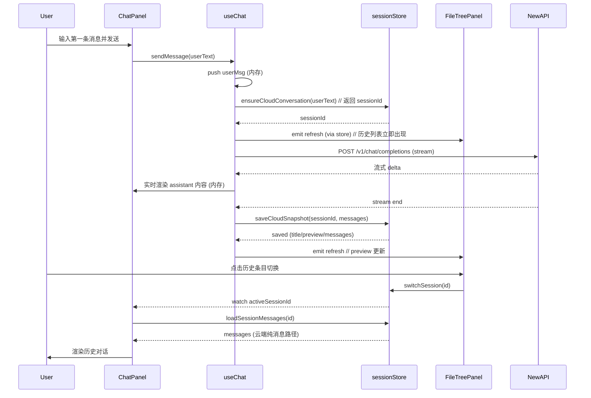

# Cloud Lightweight Independent Chat Conversation Model SDD

> 日期: 2026-06-14
> 状态: 待执行（中长期更好方案，直接落地云端独立轻量模型）
> 目标: 为云端轻量创作台（当前产品重心）建立独立的简化对话持久化模型，使云端聊天立即出现在第二列会话历史列表，像 ChatGPT 一样可靠；与桌面 OpenCode 完整 session 模型完全解耦
> 产品约束: 云端只走标准 LLM messages + system prompt + NewAPI 流式；不引入 OpenCode parts/timeline/project dir；UI 列表（FileTreePanel history tab）保持不变；桌面 OpenCode 100% 官方复刻路径不受影响
> 参考历史: 两周前（~2026-05-31 前，commit 363dec7e296a676e912a763c1db078d0d6aaa889）版本中，云端聊天已能通过“先记录用户消息 + session 持久化”可靠出现在历史列表；OpenCode 集成后被覆盖

---

## 1. 一句话定案

韭菜盒子 Studio 的云端对话（聊天）使用一套**独立的轻量 Conversation 模型**：

```text
云端发送路径（!isTauriRuntime）
  ↓
立即 push user message（老版本“先记录用户消息”精神）
  ↓
ensureCloudConversation(firstUserMessage) → sessionId （简化，无 openCodeSessionId）
  ↓
NewAPI /v1/chat/completions (stream: true) + 流式更新
  ↓
流结束 → saveCloudSnapshot(sessionId, messages)
  ↓
emit 'refresh-file-list' {category: 'history'}
  ↓
FileTreePanel history tab 立即显示（title + preview）
```

桌面端继续走完整的 OpenCode session（createOpenCodeSession + timeline + parts + project dir 贯穿）。

useChat.ts 里的云端分支成为“轻量独立路径”，不再是桌面 OpenCode facade 的 fallback。ChatPanel 里的 session 状态管理按 runtime 分治。

这直接恢复并强化两周前已验证可行的云端历史体验，同时满足“云端真正的轻量独立”中长期目标。

---

## 2. 背景与问题根源

### 2.1 当前产品定位（来自 CLAUDE.md 2026-06 更新）
- 云端轻量创作台（创作面板 + 画布 + 编辑区 + 对话简化版）是**重心**。
- 桌面是次要产品，主要承载 OpenCode 官方能力 100% 复刻。
- 对话不是完全共享核心：云端简化（标准消息列表 + system prompt + NewAPI），桌面完整 OpenCode 驱动。
- 任何改动必须优先保证云端干净、轻量。

### 2.2 历史事实（两周前 vs 现在）
两周前（commit 363dec7e296a676e912a763c1db078d0d6aaa889 附近）：
- useChat.sendMessage 先 push userMsg，明确注释：“即使 Key/API 在请求前失败，会话也能留在第二列。”
- sessionStore 模型简单（agentId / vaultId / contextPolicy，无 openCodeSessionId）。
- ChatPanel + useChat 集成触发 startNewSession + saveSession + persist，FileTreePanel history 实时可见。
- web/cloud 路径（forceCloud + resolveApiConfig）能完整走通持久化。

OpenCode 集成后（当前 codex/opencode-core-execution 分支）：
- useChat 重构为 “Wave 1 OpenCode facade”，桌面走 createOpenCodeSession / activeOpenCodeSessionId / eventBridge / timelineRows。
- 云端退化为薄的 sendWebCloudMessage（自闭环 fetch + 流更新），**完全不调用 sessionStore**。
- ChatPanel 的 “首次发消息时创建 session” 块散落在 media / OpenCode action / 桌面路径，云端早期 return 导致跳过。
- sessionStore 新增 openCodeSessionId，历史列表只认有记录的 sessions。
- 结果：云端主聊天区能看到输入输出，但第二列会话记录不显示（用户报告问题）。

最近有几个 web fix（efa6823 persist preview before streaming 等），是局部恢复尝试，但未系统性解决“云端独立模型”问题。

### 2.3 为什么必须中长期独立方案（直接做，不走短期接通）
- 短期“先接现有 sessionStore”会让云端继续背桌面 OpenCode 假设（字段、创建时机、preview 逻辑），违背“云端轻量、简洁、可快速迭代”。
- 中长期独立 = 云端拥有自己的 Conversation 生命周期，与 OpenCode session 模型平行但不耦合。
- 符合 CLAUDE.md 云端优先原则 + 老版本已验证的“用户消息先记录”体验。
- 为未来云端账号同步、轻量部署留出空间（桌面继续本地重度 OpenCode）。

---

## 3. 第一性原则与约束

### 3.1 云端第一性原则
- **对话是轻量 Conversation 资源**：id + title + preview + messages[] + created/updatedAt。
- **事实源是原始消息**：像老版本一样，原始 user/assistant 消息 push 后立即可用于 session 创建和历史列表。
- **无 OpenCode 污染**：云端记录永远不设置 openCodeSessionId，不调用 opencodeClient，不走 timeline/parts/permission。
- **UI 零感知**：用户在云端发消息，左侧“会话”tab 立刻出现（title 来自第一条 user message，preview 来自最新消息），切换加载 messages。和 ChatGPT 一致。
- **性能优先**：云端路径越薄越好（已有的 sendWebCloudMessage 保持核心），持久化是附加的异步/流后动作。

### 3.2 范围约束
**In scope**:
- useChat.ts 云端分支（sendWebCloudMessage 及调用方）的生命周期管理。
- ChatPanel.vue 中 isWebRuntime 分支的首次创建 + 流后 persist 协调。
- sessionStore.ts 的通用能力复用（startNewSession / saveSession / saveSessionPreview / loadAllSessions），增加云端简化路径支持。
- FileTreePanel history tab 的现有映射（无需大改，可加极小云端标记）。
- 立即用户体验：发第一条消息 → 历史列表出现 → 可切换加载 → 继续发消息更新 preview。

**Out of scope**:
- 改变桌面 OpenCode 任何路径（createOpenCodeSession、project dir 贯穿、timeline 渲染、permission/question UI 等保持 100% 官方）。
- 重做统一 ConversationContextEngine（那是另一条 SDD）。
- 改动 FileTreePanel 整体结构或添加新 tab。
- 引入新独立 cloudConversationStore（复用 sessionStore 表，保持列表统一）。
- 服务器端持久化（当前用 idb fallback，未来可扩展）。
- UI 视觉大改（保持现有会话列表样式）。

### 3.3 与现有 SDD 的关系
- 继承 `docs/sdd/chatgpt-like-conversation-experience-final-sdd.md` 的体验目标（progressive streaming、auto-scroll、history 可见）。
- 独立于 `docs/sdd/unified-conversation-context-engine-sdd.md`（云端轻量版可暂时不接 heavy recall engine，或走 light 策略）。
- 独立于 `docs/sdd/opencode-official-capability-carrier-sdd.md`（桌面专用）。
- 解决用户报告的“云端对话内容不在第二列显示”问题，同时满足 CLAUDE.md “对话不是完全共享核心”。

---

## 4. 架构设计

### 4.1 整体分层（云端 vs 桌面平行）
```
Cloud (Primary, Lightweight)
  useChat.sendMessage (web branch)
    → push userMsg immediately
    → ensureCloudConversation(firstUserMessage)  ← 新：轻量路径
    → sendWebCloudMessage (direct NewAPI stream)
    → on stream end → saveCloudSnapshot(sessionId, messages)
    → sessionStore (简化记录，openCodeSessionId === undefined)

Desktop (Secondary, Full OpenCode)
  useChat.sendMessage (tauri branch)
    → OpenCode session create / prompt / events
    → timeline parts / permission / project dir
    → sessionStore (带 openCodeSessionId)

Shared
  sessionStore (idb conversations + messages)
  ChatPanel (isWebRuntime 守卫 + currentSessionId 分治)
  FileTreePanel (history tab from sessionStore.sessions)
  MessageBubble / streaming renderer (部分复用)
```

### 4.2 云端 Conversation 模型（极简） + 接口定义

**判别条件（唯一且明确）**：
- 云端会话的**唯一判别条件**是 `openCodeSessionId === undefined`。
- **不引入** `mode?: 'cloud' | 'opencode'` 字段，避免两条判别逻辑导致的维护混乱。所有代码只通过 `!session.openCodeSessionId` 判断云端会话。

```ts
// sessionStore 现有 Session 接口（向后兼容，云端简化用法）
interface Session {
  id: string
  title: string
  preview?: string
  agentId?: string
  openCodeSessionId?: string          // 云端永远不设置（=== undefined 即云端）
  createdAt: number
  updatedAt: number
  messageCount: number
}
```

**云端核心接口定义**（必须实现，幂等）：

```ts
/**
 * 确保当前云端会话存在。
 * - 若无 currentCloudSessionId，创建新会话并返回其 id。
 * - 幂等：重复调用同一 firstUserMessage 返回相同 id（内部用 sessionStore 现有去重逻辑）。
 * - 内部调用：sessionStore.startNewSession('') + 设置内部 currentCloudSessionId。
 * - 副作用：触发历史列表刷新（emit 'refresh-file-list'）。
 * @param firstUserMessage 第一条用户消息内容，用于生成初始 title
 * @returns sessionId
 */
function ensureCloudConversation(firstUserMessage: string): string

/**
 * 保存云端会话快照（title/preview/messages）。
 * - 幂等：可安全重复调用同一 sessionId。
 * - 内部调用：sessionStore.saveSession(sessionId, messages) + sessionStore.saveSessionPreview(...)
 * - 约束：仅用于云端（调用方保证 openCodeSessionId === undefined）。
 * - 副作用：emit 'refresh-file-list' { category: 'history' }
 * @param sessionId ensureCloudConversation 返回的 id
 * @param messages 当前完整消息数组（包含刚流式完成的 assistant 消息）
 */
function saveCloudSnapshot(sessionId: string, messages: ChatMessage[]): void
```

创建/保存接口保持与现有 sessionStore 兼容，但云端调用时**绝不**传递 openCode 相关参数。

### 4.3 多会话管理

- **新建会话**：用户点击“新建会话”（或等价 UI 操作）时，ChatPanel 调用 `clearMessages()` + `ensureCloudConversation('')`（或空 title），立即在历史列表创建新条目。
- **切换会话**：通过 FileTreePanel history item 点击 → `sessionStore.switchSession(id)` → ChatPanel watch 触发 `loadSessionMessages`。云端记录（`openCodeSessionId === undefined`）走纯内存 messages 加载路径。
- **排序**：历史列表默认按 `updatedAt` 降序（已有 sessionStore 行为）。云端会话与桌面会话混合排序，由用户最近活动决定。
- **currentCloudSessionId** 生命周期：仅在当前激活的云端会话期间有效；切换到桌面 OpenCode 会话或新建时重置。

### 4.4 关键流程（云端） + 时序图

1. **首次消息**:
   - push userMsg。
   - `ensureCloudConversation(userText)` → 历史列表立即出现条目。

2. **流式过程中**:
   - 内存流式更新（不触碰 preview / idb）。

3. **流结束**:
   - `saveCloudSnapshot(...)`。

4. **切换加载**:
   - 已有 watch → load。



### 4.5 代码位置变更点（外科手术）

推荐采用“抽取独立轻量模块”的方式，实现云端真正的关注点分离（此为中长期推荐路径）：

- **新文件 `src/composables/chatCloud.ts`**（~300 行）：
  - 从 useChat.ts 完整抽取 `sendWebCloudMessage` + 云端生命周期管理。
  - 包含 4.2 节定义的 `ensureCloudConversation(firstUserMessage: string): string` 和 `saveCloudSnapshot(sessionId: string, messages: ChatMessage[]): void`。
  - 只依赖 `sessionStore` + `newApiClient`，**零 OpenCode 引用**（包括类型、client、eventBridge 等）。
  - 负责云端会话的创建、消息发送、流式处理、持久化触发。

- **`src/composables/useChat.ts`**：
  - 删除 `sendWebCloudMessage` 及其所有云端专属逻辑（包括相关辅助变量、web 分支处理）。
  - web 分支（`if (!isTauriRuntime())`）改为调用 `chatCloud.ts` 导出的函数（例如封装后的 `sendCloudMessage` 或直接暴露的入口，内部完成 ensure + 流 + save）。
  - 桌面 OpenCode 路径（包括 facade、event 订阅、parts 处理等）**保持完全不动**。

- 其余文件保持与前文描述一致（最小改动）：
  - `src/components/chat/ChatPanel.vue`：isWebRuntime 发送路径显式协调首次创建与流后持久化（通过 useChat 委托）；云端守卫防止触碰 OpenCode 相关代码。
  - `src/stores/sessionStore.ts`：按之前，文档化云端简化用法（以 `openCodeSessionId === undefined` 为判别）。
  - `src/components/filetree/FileTreePanel.vue`：无需改动，history tab 自动从 sessionStore.sessions 映射（云端记录自然出现）。

此方案最大化云端独立性，便于后续演进（例如云端账号同步、轻量 context 策略），同时保护桌面 OpenCode 100% 复刻路径。提取后 useChat.ts 职责更清晰（作为云/桌路由层）。

**实施提示**：提取可分两步——先整体搬迁 sendWebCloudMessage + 基础生命周期，再逐步将 ensure/save 逻辑内聚到 chatCloud.ts 并接上接口。

### 4.6 向后兼容与迁移

- 现有桌面 OpenCode 会话记录继续工作（带 openCodeSessionId）。
- 旧云端会话（如果有）可按 `openCodeSessionId === undefined` 视为云端加载。
- idb schema 无需 migration（字段可选）。

---

## 5. 实施计划（小步、云端优先、桌面零影响）

1. **文档先行**（本 SDD + 更新 CLAUDE.md / AGENTS.md）  
   - 固化“云端走独立轻量 Conversation 模型”决策。  
   - 引用本 SDD + 老快照 commit。

2. **提取云端独立模块 + useChat 委托**（核心）  
   - 新建 `src/composables/chatCloud.ts`，抽取并实现云端逻辑（sendWebCloudMessage + ensure/save 接口，按 4.2 签名）。  
   - 修改 `useChat.ts`：删除云端专属逻辑，web 分支委托给 chatCloud.ts。  
   - 验证：web dev 下发消息，sessionStore.sessions 立即有记录；useChat 云端分支干净，无 OpenCode 引用。

3. **ChatPanel.vue 云端协调**  
   - 在 web 发送入口添加/强化首次创建。  
   - 流后调用 save（复用现有 persistCurrentSession 或新 wrapper）。  
   - 加 isWebRuntime 守卫。

4. **sessionStore 文档化**（可选）  
   - 明确云端用法 + emit 保证列表刷新。

5. **FileTreePanel 最小区分（可选）**  
   - 如果 `!openCodeSessionId` 则标记为云端（图标或小标签）。

6. **验证闭环**（每步必须）  
   - pnpm exec vue-tsc -b
   - Web dev 测试全流程。
   - 桌面 OpenCode 路径 smoke test。
   - pnpm build (web) + audit。

7. **TDD / 回归**（具体 case）
   - `cloud conversation appears in history after first user message`（< 200ms）
   - `cloud conversation loads messages on switch from history`（< 500ms）
   - `cloud conversation preview updates only after stream completion (last assistant msg first 80 chars)`
   - `desktop OpenCode session is unaffected by cloud activity`
   - `stream interrupted after user message still leaves visible session entry with "回复中断" preview`
   - 更新 CLAUDE.md 描述与本 SDD 对齐。

预期周期：3-5 个小 PR。

---

## 6. 风险与缓解

- **桌面回归**：严格 `isWebRuntime` 守卫 + 每步桌面 smoke。桌面路径代码完全不动。
- **历史列表同时两种会话混淆**：可选视觉区分；产品上云端是“轻量创作对话”，桌面是“项目 OpenCode 会话”。
- **持久化失败降级**：user message 始终创建会话条目并出现在列表；`saveCloudSnapshot` 失败时记录日志，preview 显示“保存失败”或保持最后成功状态；assistant 回复中断时 assistant message 内容为“回复中断”，preview 反映该状态。
- **流式中途切换会话**：useChat 已有 `runId` / `activeRunId` 守卫（当前代码存在）。流所属的 originating sessionId 在 ensure 时绑定，切换后忽略不属于当前 run 的 delta。切换回来时若 run 仍在进行则继续追加，否则显示中断状态。
- **preview 更新时机**：**精确定义** — preview = 最后一条 assistant message 的前 80 字符（或前 3 行）。**流式过程中不更新**（减少 idb 写放大），流完全结束后**一次性**更新。
- **存储膨胀**：云端 messages 继续走现有 base64 图片分离到 documents 的机制。
- **多 AI 工具开发混乱**：本 SDD + CLAUDE.md 作为强制阅读物。

---

## 7. 验收标准（含量化）

- [ ] 云端（web dev / 纯浏览器）发第一条消息，第二列“会话”tab **< 200ms** 内出现新条目（title + preview）。
- [ ] 切换该会话能正确加载消息历史，加载时间 **< 500ms**（本地 idb）。
- [ ] 继续发消息，preview **仅在流结束后** 更新为最后 assistant message 前 80 字符，列表刷新。
- [ ] 桌面 OpenCode 功能（项目目录、timeline parts、permission 等）零影响。
- [ ] Web build 通过，类型检查通过。
- [ ] 符合 CLAUDE.md 云端优先 + 对话独立路径原则。
- [ ] SDD 本文件 + CLAUDE.md/AGENTS.md 已更新。
- [ ] 至少 5 个 TDD case 通过（见 5.7）。

---

## 8. 参考与附录

- 老工作版本快照: commit 363dec7e296a676e912a763c1db078d0d6aaa889 (useChat sendMessage “先记录用户消息”注释 + session 集成)。
- 相关 SDD（路径均为 `docs/sdd/`）:
  - `chatgpt-like-conversation-experience-final-sdd.md`（状态：最终版）
  - `unified-conversation-context-engine-sdd.md`（状态：待执行）
  - `opencode-official-capability-carrier-sdd.md`（状态：修正执行版）
- CLAUDE.md（2026-06 更新）：云端重心、对话独立路径声明。
- AGENTS.md：审查范围（useChat.ts、ChatPanel.vue、sessionStore.ts、FileTreePanel.vue 属 🔴 必检查）。

本 SDD 完成后，直接进入 TDD 执行计划（小步 + web 优先验证）。

任何 AI 协作者在执行前必须先读 CLAUDE.md + 本 SDD。