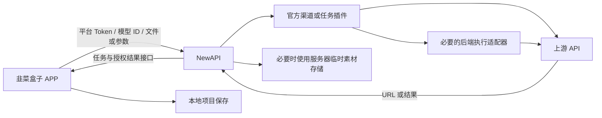

# APP 使用者与 NewAPI 唯一后台实施方案

> 日期：2026-10-06 · 状态：方案，尚未实施或部署
> 用户原则：韭菜盒子 APP 是使用者，NewAPI 是后台；所有 API 相关以 NewAPI 为准。

## 1. 唯一边界

APP 负责创作交互、本地项目、文件、提交请求、展示任务、下载恢复和保存成片。
NewAPI 负责 API Token、模型可用性、渠道、上游凭据、协议转换、任务真相、计费和结果授权。
APP 不持有供应商凭据，不选择内部渠道，不直接调用供应商上传、查询或下载接口。
桌面本机模型、用户自配 Provider、Skill/MCP 和现有文件能力保留；本方案针对平台提供的云媒体 API，
不借此删除桌面用户自己的第三方工具能力。登录/桌面授权 Gateway 的现有职责单独保留。

同一域名并不代表同一后台：当前 `/api/creations/uploads` 被 Worker 路由截走、写 KV，
属于自行构建的上传后台，必须退出云媒体 API 链路。

## 2. 实施依据与版本闸门

优先使用生产版本实际支持的官方能力，不把最新 main 文档当作已上线能力。
仓库 2026-10-01 收编方案标注 rc.40；旧运维历史还有 rc.20，实施前必须查询实际容器镜像、
运行版本、插件 apiVersion、当前官方基线与本地补丁，固定可回滚镜像。

已查看官方 main（2026-10-06 查询 SHA b48b74ab77cf289ccaaa8d99c067ce50cced4a82）：

- `openai_video` 创建与 `openai_image` 编辑支持 multipart。
- 文件占位符可转 Base64/data URL；multipart descriptor 可引用上传文件。
- 视频 content 是上游内容代理，不承诺永久存储结果。
- `/v1/files` 路由仍是 RelayNotImplemented；不能拿它当现成素材仓库。
- 插件是受限翻译层；上传上游后再继续提交、GPU 执行等编排若官方宿主不支持，
  保留现有后端执行适配器，由 NewAPI 控制路由与鉴权，不在 APP 补编排。

官方入口：
[文件与任务插件合同](https://github.com/QuantumNous/new-api/blob/b48b74ab77cf289ccaaa8d99c067ce50cced4a82/docs/plugin-api/v1.md)、
[文件路由](https://github.com/QuantumNous/new-api/blob/b48b74ab77cf289ccaaa8d99c067ce50cced4a82/router/relay-router.go)、
[结果代理](https://github.com/QuantumNous/new-api/blob/b48b74ab77cf289ccaaa8d99c067ce50cced4a82/controller/video_proxy.go)。

## 3. 素材输入：按渠道真实合同决定

| 上游需要 | APP 提交 | NewAPI 后台处理 |
| --- | --- | --- |
| 文件、Base64、data URL | 官方端点接受的 multipart 或标准内联字段 | 官方适配/任务插件直传，无公共临时存储 |
| 上游专用文件 ID（如 RH fileName） | 原始文件与用途，不传供应商令牌 | 后端执行器上传到供应商，获得 ID 后提交 |
| 公网 HTTPS URL | 一次素材上传，再带返回的素材 URL 提交 | NewAPI 管辖的临时素材服务负责存储和公开读取 |

先建立逐模型清单：模型 ID、端点、输入类型与数量、尺寸/字节限制、官方支持版本、
上游返回方式、是否要求上传编排、结果读取鉴权、当前生效通道、迁移验收证据。
先复用现有注册表与插件配置；确认官方没有描述字段时才设计最小补充合同，
不凭空指定一个“官方能力发现接口”。APP 可保留固定表单，但渠道与供应商差异收回后台。

## 4. 临时存储归 NewAPI，优先复用现有服务器

事故恢复先实施这一步，继续兼容现有 APP，后续再逐模型消除不必要的预上传。

- 保留现有 `POST /api/creations/uploads` 及 `GET /media/creation/<token>` URL 形状。
- 在 NewAPI 后台实现最小临时素材扩展：上传复用官方 Token 鉴权，校验用户、文件大小、
  MIME 与容量；读取以随机高熵 token 作为分享凭证，允许供应商无需平台 Key 读取。
- 该路径是我们维护的明确后端扩展，不是伪称官方接口。优先复用 NewAPI 的 Token、
  错误处理、日志和部署；如必须由内部文件服务执行，只有 NewAPI 可向其授权上传。
- 文件写到独立挂载目录；暂存写完原子发布，保存类型、过期与所有者元数据，禁路径穿越。
- 初始保留 20MB 单文件上限、7 天期限、10GB 总容量预算；真实磁盘检查后确认数值。
  并发上传的容量预留与磁盘余量检查必须可靠，满额拒绝新上传，不能提前删除有效素材。
- 清理只针对本服务过期素材与残留临时文件，不触碰用户文件、数据库和安装包。
- 不启用 R2，不需要新增图床账单。现有服务器截图约剩 38GB，仍需 SSH 核实、
  确认月流量套餐及现有服务增长；容量和带宽不是无限。
- 暂不引入完整图床产品。CloudFlare-ImgBed 的 Docker 本地存储可作复用候选，
  仅在它能减少代码且不另建用户/Token 真相时采用；不是必须依赖。
- 成功部署 NewAPI 上传接口后，再撤掉 Worker 对上述两条路径的拦截。
  Cloudflare 可继续作为网络代理，但不承担素材写 KV。
- 迁移前的 KV URL 有效期仅 15 分钟；按现存活跃任务决定暂时兼容或等待过期，
  不能删除尚被任务引用的旧素材。新素材永不回退写 KV。

## 5. 任务、鉴权、结果和重试

- APP 只持有用户 NewAPI Token；供应商 Key、图床管理 Token 仅在后台。
- 后端任务 ID 为真相；APP 本地记录只是进度/下载投影，不另建一个后端任务系统。
- 创建请求不盲目自动重发：响应丢失可能已提交并计费；只有已核实支持幂等时才自动重试。
- 查询、下载使用 NewAPI 官方或已验证插件端点；不得绕到供应商带 Key 的 URL。
- 接口返回公共下载 URL 时可按官方合同下载，不强制二次代理；内部授权地址由后台代理。
- 图片、音频和视频保留各自官方返回合同。不要为“统一”强行全部改成视频任务。
- 下载继续保留已实现的原任务凭据、Range 校验、断点、暂停/恢复、本地校验与原子保存。
- 结果 URL 可能到期；后台没有永久成片库。APP 尽快存本地；上游已删的结果不可靠重试恢复。
- 503 存储不可用、容量限制、401 Token 问题、上游生成失败分开呈现；日志记录阶段与
  请求关联 ID，不记录 Key 或完整敏感素材 URL。存储失败不得冒充模型生成失败。

## 6. 执行顺序与验收闸门

1. **现状核验** → 验证：生产版本/路由/插件/镜像、所有模型输入表、磁盘/流量记录完整。
2. **恢复兼容上传** → 验证：NewAPI 鉴权、磁盘临时存储、清理/容量限制；真实素材上传读回
   字节一致；不触发付费生成；Worker KV 满额不影响新上传；旧 APP 无需升级。
3. **收回供应商差异** → 验证：每个模型先锁现有字段与能力，再接官方直传/插件/必要执行器。
   先做用户正在用的主力渠道，URL 必需渠道继续用兼容上传，不一次性切所有模型。
4. **APP 精简预上传** → 验证：符合直传合同的模型不再调用临时上传；主力渠道真实端到端
   验收后再切下一批；删除对应绕路代码，不删除功能。
5. **固化运维** → 验证：上传失败率、磁盘余量、有效素材体积与清理任务有实际告警；
   NewAPI 镜像/数据迁移/插件升级有回滚演练，三平台 APP 能提交和保存结果。

真生成会计费，需提前明确验收模型与次数；自动测试使用夹具。未做生产、Windows 或
Intel Mac 验收时不得标注通过。后台恢复不需要发 APP；客户端直传改动在后续正常版本发布。

## 7. 故障恢复与撤销边界

固定上一版 NewAPI 镜像、备份配置/数据库、保留有效素材目录。失败时回滚新增接口或单条
通道，不连带撤销已正常工作的模型；KV 已耗尽时不能把回滚到 KV 叫做恢复。

此前未部署的 R2 迁移代码停用，不作为正式方案继续推进。按本方案实施时精准替换其
尚未发布的配置与实现，保留故障证据与测试目标；执行进度见下文。

## 8. 完成定义

所有平台云媒体 API 经 NewAPI 管辖；APP 不感知供应商凭据、内部地址和专用上传协议；
素材不依赖 KV 写入；必要存储可限容、自动清理、有告警；现有模型能力不减少；真实主力
渠道与三平台有验收证据。只有这些条件满足才叫迁移完成。

## 2026-10-06 执行进度

- 用户在生产主机实查：NewAPI `calciumion/new-api:v1.0.0-rc.40`，原 image ID
  `sha256:37c0f99a76ed0a5d5b376b8486173415efd1ec416042b392bd564eb0ae6a55ef`；
  `/root/new-api-new/data` 挂载 `/data`；磁盘约 34GB 可用。
- 后台扩展放在 `scripts/newapi-media/`，复用 rc.40 TokenAuth，原 API 不变；独立素材模块
  本机 race 回归通过。构建准备脚本已由用户在服务器执行，路由编译检查与完整镜像构建成功。
- 新镜像 `jiucaihezi/new-api:rc40-local-media-20261006`，服务器输出 image
  `sha256:59fe85edf1175981780b08ad99c072d07e1f29e8869e12ec45fae470dc80f24d`。
- 用户已完成生产切换。源站健康、401 鉴权、图片上传读回、Range、HEAD 全部通过；
  备份目录 `/root/jc-media-switch-20261006T012353Z`。另一次独立备份归档 411,562,741 字节，
  通过 pg_restore --list 目录检查；未做恢复演练。
- Cloudflare Gateway 已撤下上传/读取路由并移除媒体存储代码；39/39 回归通过。
  已部署版本 `8e2806b7-dc14-412c-96e5-423d09e00752`，公网 curl 已确认上传未登录 401（NewAPI 响应）及登录网关健康 200；用户服务器公网读回已通过：图片字节一致、Range、HEAD 全部通过。未验证公网授权上传、真实图片/音频/视频生成与 APP 操作。
- 备份脚本两次错误：容器默认用户不等于数据库用户；PGDATABASE 不能填完整 URI。
  修复后使用真实 DSN 拆出的库名与参数，并输出脱敏错误，5/5 回归通过。
- 所有后续 Compose 操作必须包括 image override，直到将定制镜像固化到主部署配置。
- 生产真实生成、三平台测试、逐模型直传迁移和实际告警尚未进行。
