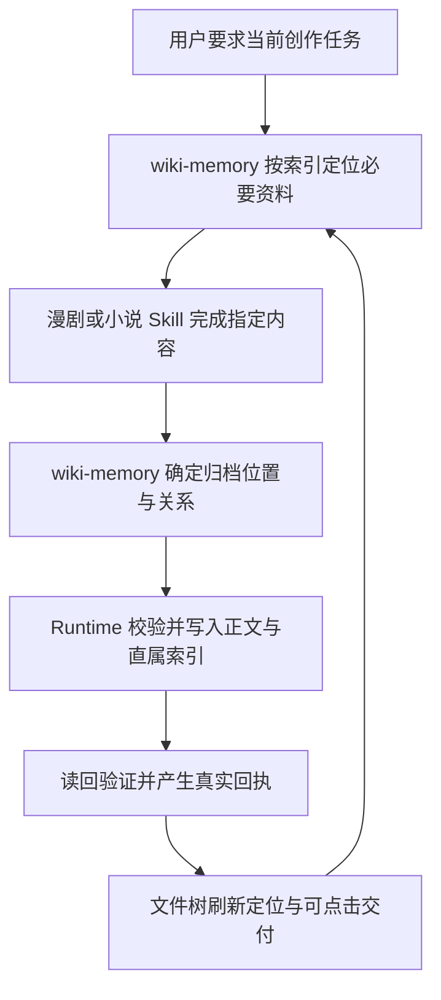

# 漫剧与小说创作核心纲领与执行方案

> 日期：2026-10-08
>
> 状态：共同归档代码已接入漫剧与小说入口；P0–P3 已实施并完成聚焦自动验证。真实模型、Desktop 人工流程及 Intel Mac／Windows 验收仍待执行。
>
> 适用：Desktop「漫剧制作」「小说创作」，以及二者使用的项目 Wiki、文件树与 Harness 保存链路。

## 1. 核心决定

**创作 Skill 负责内容，`wiki-memory` 负责知识读取与归档规则，Runtime 负责实际落盘、校验与文件树回执。**

用户要求创作正式产物时，读取必要的前期资料，完成创作并归档到当前项目；用户随时能从文件树找到真实文件，并在下一次创作中继续使用。保存属于本次交付，不要求用户另外点击“建立 Wiki”或“归档”。

这是一套规则在现有 Harness Session 中协作执行。Skill 是模型遵守的说明，实际文件操作由工具与 Runtime 执行；无需为读取、创作、归档分别建立 Agent、对话或工作流引擎。

本文是两条创作流程的共同纲领。[[开发/漫剧制作合同]] 继续定义漫剧业务路由、阶段关系、模型与媒体边界；[[开发/小说创作入口与Skill接入合同]] 继续定义小说入口、会话偏好与 Skill 接入。涉及共同职责、Wiki 归档和回执时，以本文的目标合同为准；各入口文档保留实际实现与尚未完成的迁移记录。

## 2. 用户体验与授权

1. **从任意一步开始。** 用户已有资料、剧本或资产时直接续用；只做当前要求的环节，不补跑整套流程。
2. **创作与保存一次交付。** “整理人物小传”“写第 3 集”“续写下一章”等正式产物请求包含在当前项目保存该产物的意图；位置明确且没有冲突时直接归档。
3. **讨论按讨论处理。** 仅询问判断、比较方向、求起步建议或点击模式按钮时不创建业务文件；明确要求保存讨论结果时才归档。用户明确“只在对话里”“不要保存”优先。
4. **内容有状态。** 保存草稿不等于用户确认；小说的启动及逐章确认、漫剧的方向确认等业务闸门继续由对应 Skill 管理。需要确认的内容可作为明确标注的草稿保存，不能当成已确认依据推进后续阶段。
5. **只在真实冲突处停下。** 多个 Wiki 根、同名实体歧义、旧稿与用户要求不一致或并发改动会导致错误写入时，说明具体冲突。已明确的创作请求不因每轮保存重复询问。
6. **媒体另按原授权执行。** 保存提示词不提交图片、视频或音频任务；原有媒体、画布、3D、文件及其他 Desktop 能力继续保留。

## 3. 责任边界

| 责任方 | 必须负责 | 交付给下一层 |
| --- | --- | --- |
| 漫剧入口与业务 Skill | 判断本轮产物，按既有路由创作资料、剧本、工程台本、资产与视频提示词；遵守业务确认与模型格式 | 完整正文、产物类型、集数、实体名、模型与片段范围、引用的依据、是否为草稿、创建或修订意图 |
| 小说入口与 `jc-novel` | 核心梗、世界观、人物、全书大纲、章纲、伏笔、正文及复盘；遵守启动与逐章闸门 | 完整正文、产物类型、作品与章节标识、引用的依据、是否为草稿、创建或修订意图 |
| `wiki-memory` | 按真实索引找权威资料；确定唯一根与落位；规定 Index、Properties、双链、重复、冲突及写入顺序 | 以真实页面为依据的读取与归档方案，供 Runtime 校验执行 |
| Runtime／文件工具 | 校验项目、路径、权限、版本和必填字段；写入正文与索引、读回、记录必要恢复状态、生成真实回执 | 已验证的文件路径、逐项结果、警告与待处理项 |
| 文件树与文档预览 | 消费真实回执，刷新并定位本项目文件，支持点击双链继续阅读与创作 | 用户可见的真实文件与保存状态 |

创作 Skill 不再各自定义根目录发现、索引模板、文件冲突与成功回执。`wiki-memory` 不改写作品的剧情、节奏、人物弧光或视频模型格式。Runtime 不替用户裁决语义冲突。

“落盘由 `wiki-memory` 负责”指归档规则统一归它；确定性副作用由 Runtime 执行。只同时选中两个 Skill，不能代替工具注册、权限校验和实际写入。

## 4. 一次创作的共同执行链

### 4.1 开工读取

- 从运行时的 `wiki_index` 和本轮集数、章节、实体等锚点定位；先读权威正文及当前任务所需的一层直接关系。Index 摘要用于导航，不能代替正文依据。
- 复用用户消息、附件和已有产物，不扫描整个 Wiki，不重复复制原作。来源事实、创作设计与推断分别标明。
- 续改已归档产物时读取原稿与必要依赖，保留原格式；切换漫剧／小说入口不换 Wiki 根，也不重建已有资产。

### 4.2 创作后归档

- 创作结果按一个实体、一个集的产物或一个视频片段分别提交；多产物请求列明本次必需交付清单。模型不能用摘要代替正文，也不自行填写文件指纹或伪造成功状态。
- `wiki-memory` 按共享产物映射定位已有页面。Runtime 从已校验的项目根、目录及业务标识计算或验证路径；普通创作归档不接受任意项目外路径。
- 先保存正文并读回，再更新直属索引；新建子目录时为必要的父目录补导航。已有祖先导航没有变化时不重写。
- 所有必需正文、索引与关系通过校验后，才能宣布本次归档完成。正文已保存而索引或章节确认记录失败时，保留正文、显示真实路径并明确待补动作；重试只补未完成步骤。

### 4.3 交付与续作

- 简短回执说明生成了什么、实际保存位置、跳过项或待处理项。项目文件使用 `[[完整项目路径|显示名称]]`，路径来自真实工具回执，不能靠模型猜测。
- 文件树根据回执刷新；单产物直接选中并打开，多产物显示各项链接并定位本轮主要交付文件，避免逐文件反复抢占预览。
- 回执绑定发起任务的项目与 Session。用户中途切换项目时文件仍归原项目，不在新项目树中错误定位；需要返回原项目时给出明确入口。
- 下一轮从真实产物接续，使用相同根与实体身份；不靠对话历史里的“已完成”判断文件存在。

## 5. 唯一 Wiki 与产物落位

### 5.1 根目录规则

- 根目录发现与消歧只有一套规则，由 `wiki-memory` 合同及 Runtime 共同落实。使用运行时识别的唯一项目 Wiki；不能由漫剧按标记找一套、小说按索引再找一套。
- 本仓自己的开发知识库带有 `docs/wiki/CLAUDE.md` 标题签名 `# 通用记忆工作台开发文档`，映射合同将这一路径排除为作品 Wiki；同项目里的真实 `wiki/` 可正常复用。
- 仅发现一个可用根时复用；多个候选且无法唯一确定时先请用户选择，不自动合并。不能把本仓开发知识库的 `docs/wiki/` 当成用户作品资料库。
- 项目完全没有 Wiki 时，在首次实际归档时按共享合同创建默认 `wiki/` 与必要索引；点击模式按钮不创建空库。已有不可用或用途不明的根先报告，不能视为“无 Wiki”而另建平行库。
- 下表以 `W/` 表示实际根；它只是文档占位符。已有文件以索引登记的真实路径为准，新项目按表建立必要目录。每个内容目录遵守同一份直属 `index.md` 合同。

### 5.2 共享落位表

目录分组沿用现有两条流程的能力，统一由 `wiki-memory` 管理；“共用规则”不要求所有产物塞进同一目录。

| 用户产物 | 新项目默认位置 | 保存粒度与权威位置 |
| --- | --- | --- |
| 前期故事梗概、分集梗概、背景、规则 | `W/项目资料/` 下对应页 | 一类资料一页；标注来源及确认状态 |
| 人物小传 | `W/项目资料/人物小传/<人物>.md` | 每人一页；资产页引用小传，不复制整份小传 |
| 漫剧已确认视觉与制作总纲 | `W/改编方案/项目总纲.md` | 项目共用方向；未确认方案不当成既定总纲 |
| 分集文学剧本 | `W/剧本/第001集/分集剧本.md` | 一集一页，引用前期资料与对应资产 |
| 分集工程剧本 | `W/剧本/第001集/工程剧本.md` | 一集一页，引用对应文学剧本；保留工程台本格式 |
| 分集视频提示词 | `W/剧本/第001集/视频提示词/<模型>/<片段>.md` | 一模型一片段一页，标明集数与镜头范围；引用工程台本和资产 |
| 角色、场景、道具设计与提示词 | `W/资产/角色/`、`W/资产/场景/`、`W/资产/道具/` | 同一实体一个规范档案，设计与提示词用独立章节区分 |
| 小说灵感、市场判断与核心梗 | `W/创作/` 下对应页 | 按 `jc-novel` 的产物种类组织，已有名称按索引复用 |
| 小说世界设定、全书大纲、章纲、伏笔、文案包装 | `W/创作/世界设定.md`、`大纲.md`、`章纲.md`、`伏笔.md`、`文案包装.md` | 规划与设计意图各有权威页；与原作世界规则区别标明 |
| 小说待确认章节草稿 | `W/创作/章节草稿/<作品>/第001章.md` | 每部作品一目录；保存当前待确认版本，不作为已成来源事实 |
| 小说已确认章节正文 | `W/原始材料/<作品>/原文.md` | 按现有 `jc-novel` 合同，在用户确认后逐章／逐批追加；修订已沉淀章节必须走受控更新 |
| 来源结构节点与语义分析 | 原生故事运行时在实际根下产生的来源结构树 | 只由原生 Runtime 建立和更新；模型不手写节点、编号或哈希 |
| 漫剧制作进度 | 复用 `W/制作进度.md` | 只导航已保存产物与实际待办，不复制正文、不把“已保存”当成“已确认” |

小说章纲与伏笔继续记录其业务推进信息，不新建第二份小说进度真源。待确认章节可直接打开草稿页；确认并提交来源后，草稿页改为确认记录及来源链接，避免保留第二份同版本正文。该转换要与来源追加一起校验，失败时保留草稿并准确报告。

对已确认的小说正文，未拆分时回执指向真实 `原文.md` 并说明章节；已通过原生拆分的章节指向真实节点。不能伪称每章已经有独立来源页面。确认追加成功后，草稿页转换为带 SHA-256 指纹及原文双链的确认记录；若转换失败，工具报告部分成功，保留草稿供重试，不重复追加正文。

### 5.3 索引、实体与关系

- 一事实、一关系、一产物各有权威位置。Index 只列直属子项的双链和一句摘要；制作进度及章纲引用产物，不复制整份内容。
- 角色、场景、道具复用规范名、`title`、`aliases` 与已有类型。相同实体由小说设计进入漫剧时补充提示词章节；遇到身份歧义才请用户裁决。
- 原作资料、小说设计、漫剧改编可能存在有意差异。不同创作版本通过明确的作品／版本标识和双链表达，不能仅凭同名把不同角色或设定合并，也不能将改编设计回写成原作事实。
- 内部关系使用可唯一解析的双链。新增页面先真实保存再建立引用；缺失依据标为缺失，不能生成指向不存在页面的有效关系。
- 产物落位规则与 Runtime 校验共享一份映射来源，不在漫剧路由、小说指引和保存器内各维护一套目录表。具体工具名称与字段扩展在实现阶段按现有接缝确定，不新增可编程目录配置系统。

## 6. 写入可靠性与确认规则

| 情况 | 执行要求 | 用户看到的结果 |
| --- | --- | --- |
| 第一次生成产物 | 校验类型与标识，创建正文及必要索引，读回验证 | 实际文件链接与已归档状态 |
| 同一请求重试，内容与目标相同 | 基于真实目标与指纹跳过已验证动作，补齐未完成索引 | 已保存内容得到复用，无重复正文或重复索引 |
| 已有同路径不同内容，用户未要求修改 | 保留原文并报告冲突 | 原稿链接与需要裁决的差异 |
| 用户明确续改旧稿 | 读取原文，提交更新意图；Runtime 校验读取版本未变再写入 | 更新后的实际文件与验证结果 |
| 同一资产新增提示词章节 | 只增加对应独立章节，保留小传、设计与其他提示词 | 原资产档案仍为唯一入口 |
| 提交期间人工或另一会话修改 | 重读并重新形成提案；有语义冲突才询问 | 不静默覆盖并发编辑 |
| 正文成功，索引／关系失败 | 报告各项真实状态，保留正文并补未完成动作 | “正文已保存，归档待补全”，可打开正文 |
| 主正文未成功写入 | 保留可重试的创作结果，明确失败原因 | 可复制／重试的内容，不显示“已保存” |
| 批量产物或跨重启任务中断 | 复用任务事务恢复合同，仅续做未验证动作 | 已完成文件保留，待处理清单可恢复 |

实现复用 [[开发/通用记忆工作台任务事务Runtime合同-2026-09-22]] 的结构化提案、源指纹、串行写入与逐项读回原则。简单任务不增加持久账本；需要多文件恢复时接入现有账本能力。DSH 接缝未落实前不能声称具备全局事务或跨重启恢复。

“生成完成”“正文已保存”“归档完成”“用户已确认”是不同事实。归档完成由必需动作的真实回执决定，用户确认由业务交互决定；模型结束语不能代替其中任何一项。多文件写入采用可恢复提交，不承诺平台没有提供的原子性。

### 小说正文与原生沉淀

草稿归档、用户确认后的来源追加、机械拆分与语义分析各有授权和状态。待确认章节不能提前追加到正式原文或进入来源分析；每章保存不自动开启整本分析。用户确认需要持续沉淀后，才按原生能力处理。当前 `jc-novel` 仍要求已确认正文追加后由用户触发“故事拆分”，统一归档第一阶段保留该事实，并在回执中清楚给出下一步。

后续如接入逐章增量沉淀，复用原生受控刷新、预览确认与分析进度，另行落实工具入口及验收；不以自由文件写入模拟拆分，不伪造 `source_hash`，不把摘要替代原文。明确修改旧章时评估其节点与分析影响，不能因统一保存而绕过既有更新保护。

逐章确认事实由 `jc-novel` 根据当前对话传入 `user_confirmed: true`，Runtime 同时要求草稿存在且正文完全一致；该标记是业务确认信号，不是独立加密授权凭证。

## 7. 当前实现与差距

本文基于 `main` 提交 `e447dfad` 及当前仓库读取；下表记录实际代码状态，不等同于真实用户流程已验收。

| 项目 | 当前实现 | 待验收 |
| --- | --- | --- |
| 漫剧入口 | 漫剧路由保持原业务白名单；运行时自动登记 `wiki-memory` 依赖与共享工具 | 真实模型及 Desktop 人工验收 |
| 小说入口 | `jc-novel` 与 `wiki-memory` 自动绑定、互斥并保留会话偏好；明确任务直接路由，无明确任务且无可承接节点时才问 A/B/C | 真实模型及 Desktop 人工验收 |
| 共同归档 | `wiki-artifacts.json` 提供唯一产物映射；Agent scope 内的 `wiki_save_artifact` 服务两条入口，校验项目边界、沙箱和版本，读回正文并更新带摘要的直属索引 | 多产物连续操作和真实项目存量兼容验收 |
| 小说章节 | 先写草稿；仅在明确确认且正文与草稿完全一致时追加来源。完成后草稿页转成带指纹和原文链接的确认记录；转换失败可幂等重试 | 真实对话确认闸门与故事拆分人工验收 |
| 根定位与目录 | 两条入口共用根候选及标记；唯一有效根复用、双根报冲突、缺根时首次归档创建 `wiki/`；明确排除本仓开发知识库签名 `docs/wiki/CLAUDE.md` | 真实项目双根及旧目录验收 |
| 文件树回执 | Harness 对共享 `wiki_save_artifact` 成功回执刷新、定位并打开对应 Markdown；桌面远程执行使用同一回调 | Desktop 人工确认点击定位和生成中切换项目 |
| 可靠性 | 主文读回、版本保护、逐项索引警告、确认记录转换警告及重试均有聚焦自动用例 | 原生 DSH 写入链、跨平台权限及真实并发编辑验收 |

只把 `wiki-memory` 加入漫剧白名单仍会留下两套保存逻辑。应同时收敛目录合同、写入入口和回执；通用 `wiki-memory` 查询、资料沉淀及已有文件能力继续保留。

## 8. 分阶段执行方案

| 阶段 | 必需工作与主要接缝 | 状态与完成条件 |
| --- | --- | --- |
| P0：合同与能力保留 | 共同职责、目录落位、阶段边界和保留能力已写入共同纲领及漫剧／小说入口合同 | **已完成**；导航可达，业务 Skill 与归档 Runtime 边界明确 |
| P1：共同依赖与读取 | 漫剧、小说按模式绑定共享 `wiki-memory`；会话偏好与手动选择生命周期保持原合同；两条路径预读同一项目 Wiki 索引 | **已完成代码接入**；自动化覆盖路由、依赖恢复及上下文。桌面人工与重启体验待验收 |
| P2：统一归档提交 | 单一映射和 `wiki_save_artifact` 覆盖两类产物；正文、索引、小说草稿／确认来源具备校验与幂等重试 | **已完成代码接入**；聚焦自动化验证完成。真实 DSH、旧项目冲突与用户内容仍待验收 |
| P3：真实回执与文件树 | 两入口共享成功回执，文件树刷新、选中并打开实际保存文件 | **已完成代码接入**；回调和路径校验有自动化覆盖。Desktop UI 实测待验收 |
| P4：存量兼容与实际验收 | 覆盖无 Wiki、已有 Wiki、开发知识库排除、双根、并发、模式切换、真实模型及 Desktop／Intel Mac／Windows | **进行中**；本地自动验收完成；真实模型和平台人工矩阵未执行 |

后续实现遵循“先锁定能力与失败用例，再修改，最后验证”。优先复用当前 Harness 插件、SkillRegistry、文件层、原生故事工具与文件树事件；不新增 Provider、第二套数据库、独立归档 Agent 或通用工作流框架。

2026-10-09 用户指定 App 内置 `public/skills/jc-novel` 为小说唯一准源，并授权删除个人副本；意图路由与参考读取升级见 [[开发/小说创作Skill路由升级与验收-2026-10-09]]。`jc-duanju` 的既有来源约定继续保持。所有来源与必要归档适配保留记录，避免旧包回拷恢复旧规则；个人目录操作仅限用户此次明确指定的小说副本。

### 存量项目处理

- 保留现有 Wiki 根、文件路径、人工正文及链接；共享映射先解析已存在页面，不为规范化目录另建副本。
- 多根、同名重复实体或旧稿差异先列出具体冲突与最小修正方案。移动、合并、改名或删除用户文件需要另有明确授权，本次纲领不自动授权迁移数据。
- 默认迁移是运行时规则与工具委托的升级；不批量搬文件。若确需数据迁移，须单独记录备份、路径映射、链接修复、回滚和用户数据验证。
- 跨平台沿用现有文件能力；验证 Apple Silicon Mac、Intel Mac、Windows 的文件名、路径、权限与恢复行为。未执行平台不得登记为通过。

## 9. 验收清单

| 场景 | 必须观察到的结果 |
| --- | --- |
| 新项目整理前期资料 | 首份实际产物才建立 Wiki；故事资料与每位人物小传分别可定位 |
| 写第 3 集并继续工程台本 | 两份产物进入同一集的真实目录与索引；工程台本读到对应剧本 |
| 同一角色先写小传、再设计造型与三格提示词 | 小传和一个规范资产档案相互关联；后两项分章保存，不覆盖或新建第二角色 |
| 同集分别使用 H3 与 Seedance | 按模型及片段独立保存，各自格式保留；切换不重做前期资料 |
| 小说开书、规划及续章 | 创作规划与资产按既有规范落位；待确认正文可定位到草稿；确认后逐章／逐批追加来源；确认闸门与来源沉淀状态真实可见 |
| 小说资料用于漫剧改编 | 同一 Wiki 根按真实身份复用资料；原作事实与改编差异明确，业务模式切换不建第二库 |
| 讨论方案、点击入口或明确不保存 | 不生成业务文件；不会自动提交媒体 |
| 同名不同内容、双根或身份歧义 | 明确报出冲突与真实原文件；不覆盖、不自行合并 |
| 复用、修订、人工并发编辑与重复请求 | 只在正确版本上更新；重复正文与索引不会增加；修改别的会话内容前能发现冲突 |
| 写入失败、索引失败、中断后重试 | 回执区分各项结果；已保存正文可打开；仅重试未完成步骤 |
| 当前项目在生成期间被切换 | 保存与回执归属发起项目；新项目树不被错误定位或写入 |
| 退出模式与 Session 恢复 | 用户手选依赖保留，自动依赖按模式清理；新 Agent 的插件与工具重新正确绑定 |

自动验证覆盖产物映射、根选择、索引与双链、版本保护、部分成功、依赖生命周期及事件桥接。真实模型验证读取依据、创作格式、实际工具调用与最终文件；Desktop 人工验证按钮、文件树、点击定位、编辑与重启接续。三类结果分别记录。

共同落盘完成验收前，不能只因文档、单测或按钮存在就宣布整个方案实施完成。

## 10. 来源与本次交付状态

| 依据 | 用途 |
| --- | --- |
| 2026-10-08 用户确认：创作负责内容，`wiki-memory` 负责落盘；要求编写共同纲领与执行方案 | 本文的产品决定及本次文档工作授权 |
| `public/skills/wiki-memory/SKILL.md` | 索引递进、权威正文、双链、写入顺序、冲突与真实文件回执 |
| `public/skills/jc-novel/SKILL.md`、`references/落位与提交.md` | 小说创作与目录分工、逐章追加、原生故事沉淀、确认闸门 |
| `src/runtime/memory/{manjuProduction,novelProduction,memoryChat}.ts`、`public/skills/manju-route.json` | 当前选择恢复、共享依赖差异与 Wiki 上下文 |
| `src-tauri/resources/deepseek-harness/{manju-skills,manju-wiki}.mjs`、`src/services/deepSeekHarness.ts` | 当前 Agent 保存器、根选择、校验与文件树回执接缝 |
| [[开发/漫剧制作合同]]、[[开发/小说创作入口与Skill接入合同]]、[[开发/通用记忆工作台任务事务Runtime合同-2026-09-22]] | 既有业务边界、实施记录与确定性提交原则 |

本轮将共同合同落实到创作依赖、共享产物映射与写入工具、小说章节确认状态、Wiki 根读取、Harness 回执及文件树定位。定向归档与路由测试 `18/18`、相关 TypeScript 与文件树测试 `219/219`、`pnpm run typecheck` 通过。全量 focused suite `1871/1877`；余下 6 项均在本任务未改动的 GPT Image 2.5／Grok Image／媒体计划和 HTTP 超时用例。未写入用户作品，未执行真实模型、Desktop 手工流程、安装包或 Intel Mac／Windows 验收。逐项命令与结果见 [[log]]。
