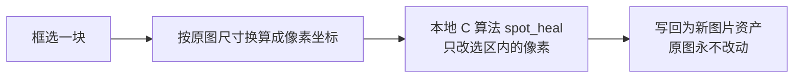

# 画布图像擦除能力 SDD（2026-09-19）

> 状态：**桌面端已实施并验收**（2026-09-19 实施，2026-09-20 用户实测通过）。算法、命令、画布交互与落盘链路均已接入，自动化测试与 App 内人工验收均已通过。
> 决策依据：用户 2026-09-19 确认「只做 A 就够了」——即「框选一块 → 擦掉」。

## 一、结论

把 `robbietilton/Compositor`（MIT）的两个纯 C 擦除算法移植进画布，配合画布已有的 Leafer 编辑器做选区，实现**离线、免费、即时的擦除能力**，覆盖擦字、去杂物、去水印。

**不引入** Compositor 的编辑器 UI、图层/蒙版文档模型、任何 Swift/AppKit/CoreImage 代码，**不依赖**任何图像编辑 API。

## 二、需求边界

用户核心用途是「AI 生图之后对这张图做微处理」。整个需求分四类，本方案只做第一类：

| 类别 | 例子 | 是否本方案 |
| --- | --- | --- |
| **擦除** | 文字擦掉/挪走、去杂物、去水印 | ✅ 本方案 |
| 语义修改 | 补耳环、戴戒指、换衣服颜色、嘴唇颜色 | ❌ 需云端编辑模型，另立方案 |
| 加字 | 图上加文字 | ❌ Leafer 文字节点即可，无需算法 |
| 参考图预处理 | 生成前先 P 一下 | ⚠️ 复用本方案的擦除即可，不单独立项 |

**不做**：图层栈、混合模式、调整层、分组、变换工具、历史面板、`.jcedit` 之类编辑文档格式、Vision 抠图、整套 Photoshop 快捷键。

理由：用户要的不是通用图像编辑器，是**「只改这一块、别的别动」**。其余能力要么已有（Leafer 合成/导出/文字），要么属于另一条链路（云端编辑模型）。

## 三、来源、许可与规模

| 项 | 值 |
| --- | --- |
| 来源 | `https://github.com/robbietilton/Compositor` |
| 许可 | MIT，Copyright (c) 2026 Wonder Assembly LLC |
| 规模 | `Compositor/Rendering/*.c|*.h` 共 879 行；本方案用 `HealPixels.c`（259）+ `ContentFill.c`（93） |
| 依赖 | 仅 `<stdint.h> <stddef.h> <stdlib.h> <string.h> <math.h> <float.h>`，无框架、无平台 API |
| 许可合规 | 移植入库**必须保留 MIT 许可文本与版权声明**，不得删除 |

平台无关性已实测：用系统 clang `-O2` 直接编译通过，零改动、零警告。

## 四、Phase 0 实测（已完成）

### 4.1 环境与素材

- Apple clang 21.0.0（arm64-apple-darwin25.6），`-O2`，单次命令行执行（含进程启动）
- 素材：仓库内真实照片 `public/landing/og-cover.jpg`，1200×630，盒装商品上有商标、配料表与 "2080" 等文字

### 4.2 数据

| 区域 | 尺寸/像素 | 内容 | `content_fill` | `spot_heal`（模式 0） |
| --- | --- | --- | --- | --- |
| A | 55×38 / 2090 px | "2080" 文字 + 荷花图案底 | 25.3 ms，文字消失、荷花瓣纹理被延续 | **7.5 ms，文字消失、填充平滑无痕** |
| B | 80×118 / 9440 px | 整块商标 + 配料表（跨多结构） | 48.8 ms，**碎片化补丁，失败** | **13.3 ms，平滑填充，干净** |

单位是端到端墙钟时间（含读 JPEG、写 PNG、并排对比图生成），算法本身占比更低。

### 4.3 三条关键发现

1. **`spot_heal` 是本场景的更优默认**。它用边缘环形匹配 + membrane 融合（把边缘差异平滑扩散），小区域无痕、大区域不崩；`content_fill` 的 PatchMatch 拷贝在小区域能延续纹理，但在大区域/跨结构时会拼出可见碎片。
2. **矩形框选对大区域不够用，魔棒不是可选项**。区域 B 失败的直接原因是矩形把「盒子内容 + 手指边缘 + 不同明暗的布料」一起框了进去。要擦得干净，必须能**只选中文字像素**——这正是 `WandPixels.c` + `wand_trace` 的用途。
3. **硬边蒙版会留下可见接缝**。Compositor 的真实交互是用画笔画软边蒙版再 `spot_heal`，所以它的成品比本次硬边矩形测试更好。产品化时必须提供软边/羽化。

### 4.4 复现命令

```bash
# 1. 取源码（本机直连 GitHub 不稳定，走本机代理）
git -c http.proxy=http://127.0.0.1:7897 -c https.proxy=http://127.0.0.1:7897 \
    clone --depth 1 https://github.com/robbietilton/Compositor /tmp/compositor-p0

# 2. 取 PNG 编解码（public domain）
curl -x http://127.0.0.1:7897 -sL https://raw.githubusercontent.com/nothings/stb/master/stb_image.h -o /tmp/stb_image.h
curl -x http://127.0.0.1:7897 -sL https://raw.githubusercontent.com/nothings/stb/master/stb_image_write.h -o /tmp/stb_image_write.h

# 3. harness 见附录，然后
clang -O2 -I/tmp/compositor-p0/Compositor/Rendering -I/tmp /tmp/p0-harness.c \
  /tmp/compositor-p0/Compositor/Rendering/ContentFill.c \
  /tmp/compositor-p0/Compositor/Rendering/HealPixels.c -o /tmp/p0h -lm

# 4. 跑（第 7 个参数选算法：fill | heal）
/tmp/p0h public/landing/og-cover.jpg /tmp/p0-a.png 1025 496 1080 534 heal
```

### 4.5 环境坑（已验证，勿再踩）

`sips -s format bmp` 写出的 BMP 与 `sips` 自己读回的 BMP 行序不自洽：文件头 `biHeight` 为负值（声明 top-down），但数据按 bottom-up 排布。因此 `jpg → bmp → png` 经 sips 往返后图像会上下翻转，即使中间不经过任何第三方代码。**不要用 sips 做 BMP 中转**，验证像素算法直接用 stb 读写 PNG/JPEG。

## 五、方案设计

### 5.1 能力闭环



### 5.2 算法选择策略

| 场景 | 用哪个 | 理由 |
| --- | --- | --- |
| 默认（文字、小杂物、水印） | `spot_heal` 模式 0（Content-Aware） | 实测更快更干净 |
| 背景是大面积平滑色/渐变 | `spot_heal` 模式 1（Create Texture） | 从边缘平滑填充并补纹理噪点 |
| 紧邻处就有现成干净图案，需要延续 | `content_fill` | PatchMatch 会拷贝邻近纹理 |
| 参考图预处理、连续修多处 | 同上，允许叠加多次擦除 | 每次结果作为下次输入 |

**先只暴露 `spot_heal`，把 `content_fill` 作为「纹理延续」高级选项**，避免一上来就给用户选算法。

### 5.3 选区

| 阶段 | 形态 | 说明 |
| --- | --- | --- |
| 第一步 | 矩形拖拽 | 复用 Leafer `editor` 插件，最快跑通 |
| 第二步 | **魔棒点选**（必做） | `wand_mask` 按颜色容差取连通区 + `wand_trace` 出闭合轮廓。这是大区域成功率的决定性因素（见 4.3） |
| 第三步 | 加/减选区 + 画刷 | 魔棒结果用画刷补漏、擦多余 |

选区产物统一是一张 **w×h 灰度位图**（0–255），正是两个算法的入参格式，中间不需要转换层。

### 5.4 跨平台策略（已按实际落地修正）

**实际采用 Rust + `cc` crate 编 native**：零额外工具链、当天可用，覆盖桌面与移动端。

原计划的 **WASM 未采用**：本机没有 wasm 工具链（见 4.5），且它不是当天可用的路径。代价是 **Web 端拿不到这个能力**，需后续另立后端或接受只在桌面提供。好在接口形状（小块 RGBA 进、小块 RGBA 出）两端一致，换后端不动前端。

大图内存：4000×4000 RGBA 单张 64 MB，整图走 IPC 不现实，所以只传「选区 + 外扩」的小块。

### 5.5 数据结构（最小）

不需要图层文档。一次擦除只产生一张新图片资产，原图永不修改；删掉新图即回到原状。

`CanvasAsset.parentAssetId` 字段已存在，可作为后续血缘标记，**本期未接**——不接也不影响还原，因为原图从未被改动过。

## 六、实施记录（2026-09-19）

实际落地路径与最初的 wasm 计划有一处偏离，原因和代价写在下面。

| 阶段 | 结果 | 落地方式 | 验证 |
| --- | --- | --- | --- |
| 像素算法层 | ✅ 已实施 | **Rust + `cc` crate 编 vendored C**，不是 wasm | `cargo test --lib image_edit` 4/4 |
| 画布接入 | ✅ 已实施 | 工具按钮 + `app.mode='draw'` 下框选 + 预览矩形 | 类型检查、创作面板契约 55/55 |
| 几何换算 | ✅ 已实施 | `canvasErase.ts` 纯函数（外扩、缩放换算、最小选区） | `canvasErase.test.ts` 7/7 |
| 落盘 | ✅ 已实施 | 复用 `writeProjectMedia` + `addMediaToCanvas`，结果作为新图片进画布 | ✅ 2026-09-20 人工验收通过 |
| 魔棒选区 | ❌ 未做 | —— | —— |
| 软边/羽化 | ❌ 未做（当前是硬边矩形） | —— | —— |
| 显式还原入口 | ❌ 未做（原图本就未被改动） | —— | —— |
| Web 端 | ❌ 不可用（Rust 命令只在桌面/移动端存在） | —— | —— |

**实现要点**

- 传的是「选区外扩 64 px 的小块」而不是整图：桌面 IPC 走 JSON 序列化，整图 base64 会到几十 MB。
- `spot_heal` 只改 coverage 矩形内的像素，块内其余部分原样返回，因此贴回原图没有接缝（Rust 测试断言了选区外零改动）。
- 图片先 `fetch` 成同源 blob 再喂 ``：`asset://` 直接加载会让 canvas 变 tainted、`getImageData` 抛错。
- 图片节点在画布上是缩放显示的（`CANVAS_MEDIA_WIDTH = 320`），框选坐标必须按 `原图尺寸 / 节点尺寸` 换算。
- 当前固定用 `spot_heal` 模式 0（内容感知）；模式 1/2 与 `content_fill` 尚未暴露给用户。

## 七、风险

1. **许可**：MIT 要求保留版权与许可文本，移植时不能删。
2. **Web 端当前没有这个能力**：Rust 命令只在桌面/移动端存在。若要在 Web 提供，需要另做 wasm 后端（工具链见 4.5）。
3. **大区域天然有上限**：内容填充的物理上限就是「周围有没有可用的干净纹理」。整块替换类需求（把一整个商品换掉）不属本能力，应走 AI 编辑链路。
4. **Compositor 是 macOS 26 上的新项目**：C 文件实测在本机 clang 21 下零警告通过，但入库后仍需在 CI 的其它平台编译器上各编一次。

## 八、验证边界

**已实测**

- Phase 0：C 源码在 macOS arm64 + clang 21 零改动编译；1200×630 真实照片上 4 组擦除（2 区域 × 2 算法）的效果与耗时；sips BMP 往返缺陷。
- 实施后：`cargo test --lib image_edit` 4/4（含「选区外零改动」与「裁剪成小块仍能擦干净」）；`canvasErase.test.ts` 7/7；`vue-tsc -b` 通过；创作面板契约测试 55/55；`cargo check` 通过。

**未验证（不得写成已通过）**

- App 内人工验收：**2026-09-20 用户实测通过** —— 选中图片 → 框选 → 擦除 → 新图进画布整条链路跑通。过程中踩到两个坑，均已修：① 切进擦除模式后 Leafer 会清掉选中态，导致按下时取不到目标、框选无反应（改为进模式瞬间锁定目标）；② 新命令漏登记 `permissions/app-commands.json`，被 Tauri ACL 拒为 `not allowed. Command not found`。
- 擦除**效果**本身在真实 AI 生成图上是否足够干净，未逐图评估（验收只覆盖链路跑通）。
- ≥4000×4000 大图的实际 IPC 耗时与内存。
- 真实 AI 生成图上的擦字效果（Phase 0 用的是商品照）。
- 硬边矩形选区的视觉接缝能否接受（Phase 0 见过轻微接缝）。
- Windows / Linux / iOS / Web 任何平台；Web 端当前根本不可用。

## 附录：Phase 0 harness 关键点

一次性验证代码，未入库。要点：

- `stb_image.h` 读入强制 4 通道：`stbi_load(path, &w, &h, &comp, 4)`，JPEG 得到 alpha=255，正好满足 `content_fill` 对「已知像素」的判定（`pixels[..+3]==255`）。
- `content_fill` 与 `spot_heal` 的选区入参都是一张 **w×h 的 0/255 灰度位图**（`content_fill` 额外要 `maskStride`）。矩形选区即在该位图上填 255。
- `spot_heal` 签名：`spot_heal(rgba, coverage, width, height, stride, opacity, mode, seed)`；模式 0/1/2 分别对应内容感知 / 生成纹理 / 邻近匹配。
- 输出按 3 倍最近邻放大、左右并排（左=原图、右=结果），便于人工判读效果。
