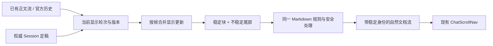

# 韭菜盒子 UI 现代化升级方案

> 日期：2026-10-09
> 状态：P1–P4 核心 UI 改造已实施；P5 类型检查、桌面快速构建与产物审计通过；原生界面人工验收和三平台安装版验收未完成
> 用户方向：借鉴 DSH 官方的交互和信息呈现；克制简洁；保留韭菜盒子识别度；优先流式输出，再完成整个桌面 App 的现代化改版。
> 本地调研基线：`main` / `8d46e6f7ee9e6e48279799c518d68944d78c22ea` / v2.2.25。
> DSH 调研基线：官方仓库 `master` 在本次读取时指向 `5badb15009ae1756c3afe0ae0cef1faafc290ccc`，提交时间 2026-10-03，发布提交为 0.2.1-alpha.1。
> 证据范围：官方源码、官方包说明、本地现行源码与产品合同；本轮未启动 DSH GUI 或韭菜盒子进行截图、性能测试、原生点击验收。

## 1. 升级后的产品体验

韭菜盒子继续作为「协作漫剧本地工作台」，让用户持续看清三件事：**AI 正在做什么、已经交付什么、下一步在哪里操作。**

视觉方向是温和中性的工作空间：大面积底色、清晰文字、少量分隔线；橄榄绿 Logo 与品牌强调色保持识别；正文、创作素材和文件预览成为视觉中心。

本次升级分成一个完整方案下的四批交付：

1. **流式阅读**：边输出边排版、稳定的正文块、清楚的运行状态、可靠的停止与定稿显示。
2. **对话交互**：过程折叠、输入区、附件与引用、模型和权限入口、消息操作。
3. **工作区**：项目树、文档预览、创作面板、媒体任务、画布与场景界面。
4. **全局一致性**：设置、Skill/MCP、搜索、弹层、主题、键盘与跨平台适配。

成败以阅读和操作是否改善衡量：长回复能够连续阅读，完成瞬间不大幅重新排版，用户上滚后视口稳定，复杂任务有过程可查，功能入口仍可找到。

## 2. 既有合同与改造边界

### 2.1 必须保留的能力

依照 `AGENTS.md` 与 [[架构/产品架构]]，桌面能力只增不减。本期逐项建立入口与操作回归清单：

| 能力 | 必须保持的操作 |
| --- | --- |
| 项目与对话 | 打开/切换项目、项目中心、文件树、对话搜索/切换/新建/拆分/重命名/删除、多窗口 |
| 对话 | 发送、编辑并重新发送、复制、停止、失败后继续、历史恢复、后台运行 |
| 创作入口 | 漫剧制作、小说创作、既有模式互斥与恢复、Skill/MCP/工具选择 |
| 项目文件 | 附件导入、文件引用、持续引用、双链输入、文档转换、读写、真实保存回执 |
| 阅读与编辑 | Markdown、大纲、链接、图片/视频/音频、评测报告、文件定位、编辑与保存 |
| 创作与画布 | 媒体生成、模型参数、参考素材、历史、下载暂停/恢复、`.canvas`、`.jccanvas`、`.jcscene`、MP4 导出 |
| 模型与权限 | 云端模型、本机模型、自定义端点、ComfyUI、真实权限档位与一次性审批 |
| 设置 | 账号、手动同步、Skill、MCP、手机连接、截图、主题、字号、桌面更新 |
| 平台 | Windows、Apple Silicon Mac、Intel Mac 的既有交互与原生能力 |

「收起」只改变呈现；保留明确的展开路径、键盘访问和当前状态。现有入口被移位时，必须在能力清单中记录原位置、新位置与到达步骤。

### 2.2 数据与布局约束

- Harness Session 继续作为完整对话、工具过程与运行时的唯一真源；视图只是投影。
- 普通项目文件继续作为知识与作品的保存形态；结果卡片从真实保存回执取得路径。
- 继续使用 Vue + Tauri，复用官方 Harness SDK、现有 Runtime、审批和媒体任务链。
- 保留「项目树｜主工作区｜右侧对话 Dock」和纯对话主区两种布局；中间仍只显示资源预览或创作面板之一。
- 设置继续作为悬浮抽屉；已有拖动宽度、窄栏吸附、画布保存与切换合同保持有效。
- 对话保持浏览器自然文档流。沿用现有滚动控制，避免引入估算行高、虚拟列表或新的手工高度补偿系统。
- Web 继续承担下载、展示、教学与视频；Mobile 继续按桌面控制器合同推进。本期重点是 Desktop，共享样式变更必须检查控制器是否受影响。

## 3. DSH 官方对照：借鉴什么，如何落在本产品

官方桌面 App 复用 Web 界面，桌面壳负责应用生命周期。真正值得逐项阅读的是 `packages/client` 下的 UI 与纯渲染逻辑。

下表链接固定到本次读取的提交；「韭菜盒子决策」是本方案设计，不表示官方采用同样的尺寸、颜色或实现。

| 对照点 | 官方源码/说明 | 韭菜盒子决策 |
| --- | --- | --- |
| 流式 Markdown | [incremental.ts](https://github.com/deepseek-ai/deepseek-harness/blob/5badb15009ae1756c3afe0ae0cef1faafc290ccc/packages/client/ui-primitives/src/markdown/incremental.ts)、[MarkdownText.tsx](https://github.com/deepseek-ai/deepseek-harness/blob/5badb15009ae1756c3afe0ae0cef1faafc290ccc/packages/client/ui-primitives/src/markdown/MarkdownText.tsx)：保留稳定前缀，重新解析不稳定尾部，源偏移用于稳定节点身份 | 采用稳定块与尾部更新思想，适配现有 `marked`；完整内容仍取自现有流与 Session |
| 语法边界 | [parse.ts](https://github.com/deepseek-ai/deepseek-harness/blob/5badb15009ae1756c3afe0ae0cef1faafc290ccc/packages/client/ui-primitives/src/markdown/parse.ts)：流式与定稿解析臂对数学有不同处理 | GFM 尽早显示；公式、Mermaid 等复杂内容采用明确的就绪规则 |
| 正文与思考 | [AssistantMarkdown.tsx](https://github.com/deepseek-ai/deepseek-harness/blob/5badb15009ae1756c3afe0ae0cef1faafc290ccc/packages/client/ui-chat/src/client/chat/AssistantMarkdown.tsx)、[ReasoningRow.tsx](https://github.com/deepseek-ai/deepseek-harness/blob/5badb15009ae1756c3afe0ae0cef1faafc290ccc/packages/client/ui-chat/src/client/chat/ReasoningRow.tsx) | 正文采用正常阅读对比度；思考单独折叠，预览按完整行/段更新 |
| 轮次与过程 | [ui-chat](https://github.com/deepseek-ai/deepseek-harness/blob/5badb15009ae1756c3afe0ae0cef1faafc290ccc/packages/client/ui-chat/README.md)、[process-groups.ts](https://github.com/deepseek-ai/deepseek-harness/blob/5badb15009ae1756c3afe0ae0cef1faafc290ccc/packages/client/ui-chat/src/client/conversation-nodes/process-groups.ts) | 继续沿用本地已经实现的按轮次整理；优化折叠状态、活动摘要与失败显示 |
| 跟随与阅读 | [use-scroll-follow.ts](https://github.com/deepseek-ai/deepseek-harness/blob/5badb15009ae1756c3afe0ae0cef1faafc290ccc/packages/client/ui-chat/src/client/chat/use-scroll-follow.ts)、[use-chat-scroll.ts](https://github.com/deepseek-ai/deepseek-harness/blob/5badb15009ae1756c3afe0ae0cef1faafc290ccc/packages/client/ui-chat/src/client/chat/use-chat-scroll.ts) | 将用户的跟随意愿与程序滚动区分；现有 `ChatScrollNav` 继续成为唯一滚动入口 |
| 工具结果 | [ui-tool](https://github.com/deepseek-ai/deepseek-harness/blob/5badb15009ae1756c3afe0ae0cef1faafc290ccc/packages/client/ui-tool/README.md) | 保留一个 callId 一条工具记录；摘要常见、详情按需、错误能定位 |
| 输入区 | [ui-conversation](https://github.com/deepseek-ai/deepseek-harness/blob/5badb15009ae1756c3afe0ae0cef1faafc290ccc/packages/client/ui-conversation/README.md)、[ui-input-trigger](https://github.com/deepseek-ai/deepseek-harness/blob/5badb15009ae1756c3afe0ae0cef1faafc290ccc/packages/client/ui-input-trigger/README.md) | 借鉴草稿、引用、候选与发送反馈的层次；保持咱们现有发送合同 |
| 附件 | [ui-attachment](https://github.com/deepseek-ai/deepseek-harness/blob/5badb15009ae1756c3afe0ae0cef1faafc290ccc/packages/client/ui-attachment/README.md) | 文件与图片可识别、失败可重试、删除按钮可键盘触达；拖放目标按本产品路由显示 |
| 工作区布局 | [ui-layout](https://github.com/deepseek-ai/deepseek-harness/blob/5badb15009ae1756c3afe0ae0cef1faafc290ccc/packages/client/ui-layout/README.md)、[ui-sidebar-right](https://github.com/deepseek-ai/deepseek-harness/blob/5badb15009ae1756c3afe0ae0cef1faafc290ccc/packages/client/ui-sidebar-right/README.md) | 借鉴面板尺寸让位与清晰的窗口边界，按本产品现有 Dock 合同安排优先级 |
| 设置与模型 | [ui-settings](https://github.com/deepseek-ai/deepseek-harness/blob/5badb15009ae1756c3afe0ae0cef1faafc290ccc/packages/client/ui-settings/README.md)、[ui-model-selection](https://github.com/deepseek-ai/deepseek-harness/blob/5badb15009ae1756c3afe0ae0cef1faafc290ccc/packages/client/ui-model-selection/README.md) | 按用途分组；模型身份、来源和当前选择明确；字段与状态分层 |
| 主题与品牌 | [ui-theme](https://github.com/deepseek-ai/deepseek-harness/blob/5badb15009ae1756c3afe0ae0cef1faafc290ccc/packages/client/ui-theme/README.md)、[ui-brand-official](https://github.com/deepseek-ai/deepseek-harness/blob/5badb15009ae1756c3afe0ae0cef1faafc290ccc/packages/client/ui-brand-official/README.md) | 使用自己的 Logo、品牌色与文案，统一语义令牌和主题状态 |

官方也有队列、Steer、Trajectory、子代理面板和多档工作详情等能力。它们属于各自业务合同；本期的界面改版不据此增加新运行能力。先做好已有信息的阅读与操作。

## 4. 本地现状与根因判断

下列判断来自当前代码，不把旧 TDD 的待办当成今天仍缺失的功能。

| 当前事实 | 对体验的影响 | 处理方向 |
| --- | --- | --- |
| `streamingTextRenderer.ts` 每次切分完整正文，只识别简单反引号围栏，其余文字转义后加换行 | 标题、列表、粗体与表格在流式时无法按最终形态阅读；完成时会切换排版 | 统一 Markdown 基础语法与样式，逐块更新 |
| `MemoryMarkdown.vue` 使用 `v-html` 替换渲染内容 | 长文本重复处理；选择范围、代码块横向位置与节点身份可能受影响 | 稳定块节点、尾部更新；这些影响须以 UI 复现和基准确认 |
| 临时正文使用 `streaming-assistant` ID；最终权威历史随后接管 | 交接时存在换节点与视口跳变的风险，尚未在本轮复现 | 明确从 live 到 settled 的展示身份映射，原子接管 |
| 现有代码已按轮次整理最终正文、中途叙述、思考、工具与重试；完成过程可折叠 | 基础结构可复用；不应重新开发一套消息系统 | 优化当前组件的状态与呈现 |
| 当前过程开合通过 `details` 与运行/停止/失败状态共同控制 | 用户手动选择需要与自动状态转换更清楚地协调 | 单轮临时 disclosure 状态，明确自动折叠条件 |
| `.memory-message.streaming` 将整条消息透明度设为 `.85` | 输出时正文可读性低于最终回答 | 正文全程相同对比度，活动提示局部化 |
| Logo 为 `#4A5D23`；默认浅色主色为蓝色、深色为金色，多处硬编码局部样式 | 品牌与操作强调的关系不一致，组件细节容易各自演化 | 统一品牌与语义令牌，主题继续保留各自色系 |
| Workbench、CreationPanel、ProjectFileTree 分别约 4711、6386、4462 行 | 一次同时改布局、运行状态、渲染和样式风险较高 | 按显示职责逐项改造，抽出真正重复使用的呈现组件 |

本期首要根因是**流式与定稿的展示规则不同、更新粒度偏大**。优先把这一层统一，随后全局视觉规范才能同时改善聊天、文档、代码块与结果卡片。

## 5. 视觉系统

### 5.1 品牌与色彩

保留现有 `/logo.svg` 形状和「韭菜盒子」名称。Logo 主要出现在项目树顶栏与空白起步页；消息区每轮至多出现一次轻量的助手身份，纯工具轮避免孤立品牌标题。

以下是新视觉的初始设计值，实施时需测量各实际组合的对比度：

| 语义 | 浅色基准 | 深色基准 | 用途 |
| --- | --- | --- | --- |
| 主背景 | `#F7F8F5` | `#171A16` | 工作区外层 |
| 阅读表面 | `#FFFFFF` | `#1E221C` | 正文、输入区、抽屉 |
| 次级表面 | `#F0F2EC` | `#272D23` | 用户消息、代码块、选项背景 |
| 一级文字 | `#242A20` | `#EEF1E9` | 正文与主要字段 |
| 二级文字 | `#626B5B` | `#B5BEAA` | 过程、标签、说明 |
| 品牌强调 | `#4A5D23` | `#BDD28E` | Logo、主操作、选中态、链接 |
| 边界 | `#DEE3D8` | `#3B4335` | 分隔线、输入边界 |
| 成功 | `#386747` | `#A6CCAF` | 已保存、已连接 |
| 警告 | `#966820` | `#E6C17D` | 输出上限、需要处理 |
| 错误 | `#B9443A` | `#E9AAA2` | 失败、危险权限与破坏性操作 |

色彩按语义控制：普通工具步骤使用中性文字；只有状态需要辨认时使用状态色。品牌色不铺满全部面板，也不用于大段正文和每一级标题。

保持现有六个主题 ID 和存储偏好：白色、浅色、黑夜、护眼、冷灰、暗紫。白色与浅色使用上述现代基准的白底/温和底色版本；黑夜使用深色基准；其他主题保持原色系，统一表面、文字、边界与状态的语义关系。当前用户的主题选择不因升级重置。

继续让 `--jc-*` 成为来源，原 `--olive`、`--paper`、`--ink*` 等别名映射到同一套值。先补语义和检查覆盖，再逐项迁移使用点，避免同一阶段维护两套冲突色值。

### 5.2 字体、间距、圆角与图标

| 项目 | 规范 |
| --- | --- |
| UI 字体 | 复用系统/现有字体；中文有本地回退，Windows 与 Mac 都可离线显示 |
| 默认字号 | 沿用当前 14px 全局基准；正文约 1.7 行高，过程约 1.5；原 16/18/30px 档位全部保留 |
| 标题 | 按内容层级增加字号或字重，控制强调色与横线；聊天标题比正式文档标题更紧凑 |
| 间距 | 4/8/12/16/24/32px；控件内部以 8/12px 为主，区域之间 16/24px |
| 圆角 | 小控件 6px，按钮/字段 8px，输入区/媒体卡片 12px；减少同区域多种圆角 |
| 行高/热区 | 工具条与列表常规 32–36px；图标视觉 16–18px，点击热区至少 32px |
| 图标 | 复用 `JcIcon`；图标与文字配对，关键动作有可访问名称；统一线条重量 |
| 阴影 | 仅用于浮层、输入区轻微抬升和拖动反馈；面板主要靠表面层级与边界区分 |
| 数字与路径 | 时长和统计采用等宽数字；路径可换行/复制，摘要省略时可查看完整值 |

### 5.3 动效

悬停和焦点变化控制在 120–160ms；抽屉与弹层控制在 160–200ms。窗口和 Dock 拖动直接跟手。

流式正文按实际增量出现，不播放逐字打字机效果。活动标签可使用很弱的文字高光或单点呼吸，同一活动行最多一种动画。停止、完成、失败立即关闭动画。

`prefers-reduced-motion` 下关闭高光扫动、旋转和非必要过渡；保留静态状态词。旧 WebView 不支持的颜色混合或动效必须有静态令牌回退。

## 6. 信息架构与工作区布局

### 6.1 全局层级

```text
韭菜盒子
├─ 项目区：项目选择 / 文件树 / 搜索 / 新建窗口
├─ 主工作区
│  ├─ 对话：未打开资源时
│  ├─ 文档或媒体预览：打开项目资源时
│  └─ 创作面板：打开画布与媒体创作时
├─ 对话 Dock：资源或创作面板打开时
└─ 全局设置抽屉：账号、模型与服务、同步、Skill、MCP、手机、截图、外观、更新
```

保持现有入口关系；以当前任务内容决定主区。对话从主区进入 Dock 时，消息、草稿、引用、运行状态与滚动位置保持同一份。

### 6.2 两种主要画面

纯对话形态：

```text
┌──────────────────┬────────────────────────────────────────────┐
│ Logo 韭菜盒子     │ 对话名称 ▾  ＋新建       模型 ▾  设置       │
│ 项目名称 ▾       ├────────────────────────────────────────────┤
│ 搜索             │                                            │
│ 文件树           │                    用户问题                │
│                  │ 已完成 8 个步骤 ▸                          │
│                  │ 最终回答，以自然文档流阅读                 │
│                  │ 文件/图片/媒体结果                         │
│                  │ 复制 · 既有消息操作                         │
│                  │                                            │
│                  │ 正在读取角色资料                           │
│                  │ [附件与持续引用]                           │
│                  │ [写下问题或创作要求……                    ] │
│                  │ ＋ @  漫剧制作  小说创作   权限 ▾     发送 │
└──────────────────┴────────────────────────────────────────────┘
```

创作/阅读形态：

```text
┌──────────────┬──────────────────────────────┬─────────────────┐
│ 项目与文件树 │ 文档标题 / 创作画布          │ 对话 ▾   模型 ▾ │
│              ├──────────────────────────────┤                 │
│ 当前文件高亮 │ 正文、大纲、画布或媒体      │ 简洁过程摘要    │
│              │                              │ 回答与结果      │
│              │                              │                 │
│              │                              │ 当前运行状态    │
│              │                              │ 输入区与操作    │
└──────────────┴──────────────────────────────┴─────────────────┘
```

图中元素是视觉结构，不代表增加新的固定入口。实际按钮依照现有能力清单和容器宽度放置。

### 6.3 尺寸与让位规则

- 纯对话宽度在现有 860px 上限内收敛正文阅读列，建议正文约 720–800px，输入区与阅读列视觉对齐。
- Dock 沿用默认约 360px、完整态约 220px 下限、约 56px 窄栏吸附、最近完整宽度恢复。
- 对话容器不足 560px 时沿用现有顶部图标化规则；不以整个窗口宽度推断 Dock 内的组件布局。
- 940px 以下沿用既有窄窗布局；优先收起项目树，资源与对话按当前实现切换。全面改造窄窗行为前先保留原合同。
- 220–360px Dock 使用单列卡片、可横向滚动的表格/代码、精简标签和清晰的展开操作；权限和停止按钮始终可达。
- 30px 超大字号下允许工具条换行、设置列表更高、图标热区扩展；容器不能固定高度裁掉文字。
- Mac 保持交通灯净空与原生拖动区域；Windows 保持窗口按钮、新建窗口入口与无菜单栏场景下的访问路径。

## 7. 流式输出：本轮最高优先级

### 7.1 面向用户的显示合同

| 内容 | 输出期间 | 停止/失败后 | 正常完成后 |
| --- | --- | --- | --- |
| 普通文字 | 正常对比度，按增量出现 | 保留已收到文字 | 原位置接管定稿 |
| 标题、段落、列表、粗体 | 边输出边显示结构；尾部允许局部变化 | 以现有内容稳定显示 | 保持基础排版一致 |
| 未闭合行内语法 | 保守显示原文，避免凭空补字 | 保留真实片段 | 以真实完整内容解析 |
| 代码块 | 围栏成立后出现同样的代码容器；内容持续增加 | 可查看/复制已收到代码，明确未完成 | 已闭合且可见的代码块高亮 |
| 表格 | 表头与分隔行成立后显示；正在生成的行局部更新 | 保留已有表格 | 对齐列宽，局部横向滚动 |
| 链接与项目引用 | 未形成完整目标前作为文本；形成后显示链接 | 保留安全可用的已有目标 | 复用文件/报告/外部链接路由 |
| 图片 | 目标完整、可解析后显示占位与加载态 | 失败有说明与重试 | 保持容器位置，可打开原图 |
| 公式 | 默认以原始数学文本/代码样式展示未就绪片段 | 内容保留 | 内容就绪后使用现有公式渲染 |
| Mermaid | 显示代码容器与等待就绪状态 | 保留可复制源文 | 渲染成功展示图，失败保留源文与说明 |

复杂图、公式和迟到的引用定义允许发生可说明的局部增强；普通正文、标题和列表不应在完成时整篇换形。

### 7.2 渲染策略

推荐路线是**保留当前 `marked`、DOMPurify、代码高亮、公式与 Mermaid 工具，增加块级增量呈现**。



实施细则：

1. 先从现有 Markdown 渲染器分出可复用的基础规则，流式与定稿共享代码容器、表格、标题与链接样式。
2. 使用词法 token 的原始文本边界记录稳定块和源范围；尾部保留足够的解析上下文。冻结规则由实际 `marked` 语法行为与用例确认。
3. 不能直接假定「最后两块之外一定稳定」。列表续接、Setext 标题、GFM 表格、引用定义及跨块结构必须有保守失效规则；模糊结构继续留在尾部。
4. 新增引用定义等会改变前文语义时，使关联块失效；必要时重新解析全文。正常纯追加更新只处理尾部。
5. 开放代码围栏保持固定容器与代码头，只追加可见代码；长代码的高亮按块就绪/可见调度，不能每个 token 高亮整段历史代码。
6. 块身份由当前展示轮次/正文块身份与源位置组成。文本被替换、截短、新 attempt 或切换 Session 时提升显示版本并清理该版本缓存。
7. 普通更新按 `requestAnimationFrame` 合并，同一帧最多提交一次显示变化；状态事件、审批和终态不被文本节流阻塞。数据接收和持久化不受显示调度影响。
8. 正常结束、停止与失败都立即刷新尾部；完成时按权威内容校准。原始字符串必须完整保留，视觉缓存可随时从原文重建。
9. 稳定块使用带 key 的 Vue 节点；避免每次给整篇文章重新赋 `innerHTML`。块内 HTML 仍须走现有安全清理。
10. 异步 Mermaid、图片与高亮提交前检查 Session、显示版本和目标节点；旧结果不能覆盖用户已切换到的内容。

官方增量模块依赖 mdast 语法树，直接接入会带来解析器与语法差异。此处采用其更新粒度与节点稳定性思想；用当前解析器实现时，必须先完成等价性与边界验证。

### 7.3 实时到定稿的交接

当前临时 `streaming-assistant` 到官方历史的接管，需要成为明确的视图合同：

- 以现有 run、官方 turn/step 信息关联正在显示的正文；最终消息到达后，对齐对应权威记录再释放临时状态。
- 视图映射只用于保持 DOM 与阅读连续性，不写入第二份消息表，也不改变 Session ID。
- 接管发生在一次视图提交中；同一条回答不会同时出现 live 与 settled 两份，也不会先清空再出现。
- 定稿若修订了已显示内容，以权威内容为准；尽可能保持未变块的节点，变化部分局部校准。
- 一个任务包含多次模型请求时，保留当前已有的过程/最终答案区分；新请求不误清除该轮已完成过程。
- 停止后关闭活动动画、展示「已停止」与已收到内容；历史补读失败时保留当前缓存与可见错误状态。

### 7.4 滚动规则

`ChatScrollNav` 继续负责跟随决定，消息、过程、图片与 Mermaid 更新只通知这个入口。

- 用户处于底部：新正文、工具状态和可见媒体增长后保持跟随。
- 用户主动上滚：立即暂停跟随；显示轻量「回到最新」按钮。有新内容时可加提示点，点击才恢复。
- 程序滚动不被当成用户操作；代码、表格和过程详情内的滚轮只作用于对应区域。
- 连续流式跟随采用直接位置更新，避免不断启动平滑动画；显式点击返回最新可以使用一次短过渡。
- 用户发送新消息后，展示自己的输入与新任务起点；保留现有主动发送的滚动行为。
- 自动折叠只在不会破坏当前阅读位置时执行；用户已离开底部时暂缓折叠，避免通过手工测高补偿收起内容。
- 切换主对话/Dock、打开预览、切换会话、重新展开窄栏后恢复现有滚动状态。

## 8. 任务过程与最终回答

### 8.1 一个轮次的层次

```text
用户问题

处理过程摘要                       展开/收起
  思考：已完成段落的短预览
  读取 角色卡.md                  已完成
  修改 第03集.md                  已完成
  重试记录                       可查看原因

最终回答
正式结果文件 / 媒体任务 / 评测报告
复制与现有消息操作
```

默认让最终回答和交付结果成为最清晰的层。正文处于流式状态时仍与最终正文使用同样的字号、颜色和阅读宽度。

### 8.2 过程开合

| 状态 | 默认呈现 | 用户操作优先级 |
| --- | --- | --- |
| 刚开始 | 一行真实活动状态 | 不出现空步骤容器 |
| 运行中 | 展示当前活动与最近 3–5 条过程；完整过程可展开 | 用户可收起过程，当前活动仍显示 |
| 等待审批 | 审批操作突出，已完成过程可查 | 审批不受过程折叠遮挡 |
| 正常完成 | 可折叠为「已完成 N 个步骤」；最终答案始终可见 | 用户已展开/正在阅读时保留选择 |
| 停止 | 保留过程与部分正文，显示已停止 | 不自动隐藏用户刚看的内容 |
| 失败 | 失败行常驻，失败位置与过程可查 | 用户仍可手动收起详情 |
| 历史打开 | 完成过程默认折叠；失败状态可见 | 展开状态仅属本次视图，不改日志 |

当前轮的手动开合与自动默认值分开存放，作用域为 Session + 轮次。普通响应更新不得重新把用户手动选择覆盖掉。历史缓存范围跟随当前会话，离开后可释放。

### 8.3 思考、工具与重试

- 思考默认折叠；预览取已完成行/段的真实文字，避免每个字横向追逐。缺少推理内容时不绘制空「思考」行。
- 思考展开后才挂载完整阅读内容，使用同一套增量 Markdown；既有导出/复制对推理内容的边界继续执行。
- 工具摘要包含中文动作、关键文件/命令、状态；完整路径、参数与结果通过详情展开查看。
- 工具按 callId 配对，准备/执行/结果保留同一条身份；工具结果的截断提示与复制范围说明清楚。
- 大结果继续按现有上限截断并按需挂载；正文区不被几十万字符的工具结果撑开。
- 真实失败原因、输出上限与自动重试是不同状态。重试次数和倒计时来自已有事件；终态失败单独保留。
- 当前活动必须来自运行事件或已收到的过程，不编造「分析 60%」「即将完成」等进度。

### 8.4 运行状态与统计

输入区上方保留一条紧凑运行状态：如「正在读取角色资料」「正在生成回答」「等待你的批准」「将在 4 秒后重试」。轮次过程显示历史，底部状态显示当前操作。

统计使用低权重文字；缺失的用量或时间不填 0。首次交付保留当前已有耗时/指标；后续如展示每轮 token，总量须满足完整轮次、所有相关请求用量齐全、计数口径一致。仅有最后一次请求用量时不能标成整轮用量。新增性能面板不作为这次改版的必需项。

## 9. 输入区、引用、模型与权限

### 9.1 输入区结构

```text
[附件、当前引用、持续引用]     可横向浏览
[可自然增高的正文输入区域]
[＋附件] [@] [漫剧制作] [小说创作]   [权限 ▾] [发送/停止]
运行状态与现有必要指标
```

- 输入区采用单一柔和边界，焦点时提升边界对比；错误位于对应项附近。
- 草稿、正在上传的附件和引用保持可识别。失败的提交不得覆盖用户后来新输入的草稿。
- 普通输入、候选菜单、中文 IME、粘贴和多行快捷键保持现有行为；升级后逐项人工检查。
- 运行中仍按现有发送/停止规则工作；停止作为明确动作，用户不需要通过隐藏菜单找到它。
- 大字号和窄 Dock 下操作行可以换行；主要动作与权限入口保持可见。

### 9.2 附件与引用

- 图片采用缩略图；普通文件显示名称、类型与导入状态；文件名省略但完整名称可触达。
- 持续引用与单轮附件有明确标签；移除动作说明解除的是哪种引用。
- 复制、上传、转换与导入均展示真实状态；失败项可单独处理，避免整批信息被一个错误吞没。
- 文件引用点击进入既有项目预览；附件/参考素材与输出结果沿用当前资源标识。
- 拖入文件时，仅对实际接收区显示高亮与文案。对话、文件树、创作画布的路由继续按既有原生拖放合同判定。

### 9.3 候选与创作模式

- 保留 `@`、Skill、MCP、项目文件与 `[[` 的既有输入方式；专项入口只加载自己的候选。
- 候选显示图标、名称、短描述与来源；键盘选择清楚，长列表只滚动候选区域。
- 漫剧制作与小说创作在宽屏中保留文字标签；选中态用浅品牌底色与小标记。
- 窄屏如需收纳到菜单，菜单触发器必须显示当前模式，且两种创作入口仍可一至两步到达。
- 模式互斥、依赖 Skill、按对话恢复和文件归档继续由现有合同处理。

### 9.4 模型与权限

- 模型菜单保留当前模型、来源分组与搜索；文本模型、媒体模型的业务范围仍分属原选择器。
- 模型名称与实际请求 ID 的区别留在详情层；选择器不暴露无助于选择的内部字段。
- 尚未登录、模型加载、空列表、连接失败分别给出相应状态和可操作入口。
- 权限入口保留「仅可查看 / 工作区内修改 / 完全权限」的语义；以官方宿主回读状态更新显示。
- 完全权限继续使用清楚的危险色；一次性允许与长期权限切换保持不同操作。
- 审批卡显示动作、目标与必要摘要，「本次允许」「拒绝」「调整权限」位置固定；等待审批时不靠颜色单独传递状态。

## 10. 项目树、搜索与起步页

### 10.1 项目树

顶栏保留 Logo、项目切换、新建窗口与隐藏项目树。文件列表采用一致行高，选中与悬停分开显示；长路径保留名称省略与完整路径查看。

文件操作默认在悬停/键盘焦点时出现，触屏环境常驻必要操作。现有导入、文件夹、重命名、删除、项目地图、故事拆分、素材与画布操作全部列入能力回归。

AI 保存文件后，以现有真实回执刷新、选中和定位；轻量提示「已保存到……」，路径可点击。不能根据模型口头声称直接标记已保存。

### 10.2 搜索

复用现有全局搜索与对话搜索。统一结果项：标题、所属项目/路径、必要片段、类型图标；空结果提供短说明，错误给重试。

搜索框、结果焦点与关闭后的焦点返回遵循统一弹层规范；搜索不引入新的索引或自动后台扫描能力。

### 10.3 空白起步页

小 Logo、一个短提示和当前项目信息足够。无项目时突出打开项目；已有项目的新对话突出输入要求，并可使用现有漫剧/小说入口。示例提示填入输入框，由用户发送。

不把起步页做成需要连续选择多步的向导；当前产品「打开即聊」的路径保持直接。

## 11. 文档、媒体、画布与交付结果

### 11.1 Markdown 阅读与编辑

- 阅读/编辑状态、文件名与保存状态形成统一头栏；只有当前可执行的动作具有主要强调。
- 保留文档大纲与单列展开合同；窄窗大纲收起后不占空列。
- 聊天与文档共享基础 Markdown 规则，但使用 `chat` 与 `document` 的视觉变体。文档允许较明显标题层级，聊天控制标题占用。
- 代码块复制有短暂的成功反馈；表格与代码横向滚动不带动整页。
- 文件链接、评测报告、双链、反链和项目定位继续走现有路由。
- 长文档图表异步增强与编辑保存互不覆盖；未保存修改在切换时遵守现有保存合同。

### 11.2 结果卡片

统一已交付信息的骨架：**名称/缩略图 → 真实状态 → 项目路径 → 当前可执行动作**。

| 结果类型 | 主操作 | 次操作 |
| --- | --- | --- |
| 已保存文档/脚本/提示词 | 打开预览 | 定位项目文件、既有复制操作 |
| 生成图片 | 查看原图 | 定位、作为参考素材等既有动作 |
| 视频/音频 | 播放 | 下载状态、定位、既有素材操作 |
| 媒体计划 | 在创作面板中调整 | 查看原参数 |
| `.jcscene` | 打开场景 | 查看已有导出与位置 |
| 评测报告 | 应用内查看报告 | 定位文件 |
| Skill 安装确认 | 现有安装/修订操作 | 来源、状态与错误 |

这里只统一呈现，不将所有产物强制包装成新业务对象。继续复用各现有卡片的回调、任务 ID 与保存回执。

### 11.3 创作面板

- 顶部：画布名称、画布切换、新建画布、生成历史、已有帮助入口；宽度不足时收纳低频操作。
- 画布：保留导入、选择、标注、擦除、缩放与参考选择；工具栏分组、选中状态和热区统一。
- 生成区：按照「生成类型/模型 → 提示词 → 参考素材 → 参数 → 提交」整理现有输入。
- 参数仅按模型真实能力展示；必需参数外露，已有进阶参数可以折叠，并展示当前非默认值。
- 提示词增强的文本结果与真实视频生成保持清楚区分，使用各自实际状态与输出类型。
- 生成历史卡片突出缩略图、模型、状态与下一步；错误详情、重试保存、重新生成仍沿用原语义。
- 画布与资源切换仍复用现有保存 Promise，UI 收纳不得改变保存时序。

### 11.4 媒体任务状态

按现有任务状态展示「提交 / 生成 / 下载 / 保存 / 已完成 / 已停止跟踪 / 失败」中实际适用的阶段。

已生成但下载失败，应显示结果已生成及下载失败，并提供现有继续下载/重试保存；避免引导重新付费生成。没有真实进度时使用阶段标签与等待状态。有字节进度时展示真实已下载量与总量。

取消未提交、停止等待、暂停下载和上游继续生成的区别保留原合同措辞；美化状态色不能把这些状态统一成「已取消」。

## 12. 设置、Skill、MCP 与全局弹层

### 12.1 设置抽屉

将横向拥挤的分类整理为抽屉内导航与内容区；窗口不足时使用顶部分类菜单。外层仍是现有悬浮抽屉。

建议分组：

| 分类 | 内容与保留项 |
| --- | --- |
| 账号 | 登录、账号状态、API 凭据；云端身份与模型 Key 分工保持清楚 |
| 模型与服务 | 现有云端配置、Ollama、自定义端点、ComfyUI；从账号页中整理到该分类 |
| 同步 | 当前项目、同步状态、上传覆盖云端、下载覆盖本地及原确认 |
| Skill | 内置/我的 Skill、目录、安装、管理、AI 新建/修改等全部现有操作 |
| MCP | 已连接/未连接、工具数量、配置、连接与诊断 |
| 手机连接 | 配对、设备、连接与既有控制器设置 |
| 截图 | 原生权限、快捷键、已有截图入口与保存方式 |
| 外观 | 六主题、四字号；即时预览，沿用当前偏好 |
| 更新与关于 | 版本、检查、下载/安装状态、既有退出/安装约束 |

分类移位仅涉及导航与呈现，原表单状态、凭据持久化和平台条件必须保留。长表单使用就近说明、错误和保存反馈，减少全页重复成功提示。

### 12.2 Skill/MCP

列表优先显示名称、来源和实际状态；详细正文、配置与诊断按需展开。已安装与可安装项可辨认，禁用/断连状态保留说明和下一步。

复用当前读取与安装能力；候选仍按入口加载。列表美化不能恢复全量 Skill/MCP/项目文件同时搜索导致的卡顿路径。

### 12.3 浮层规范

- 菜单、弹出选择器、抽屉、确认框各使用固定层级；同类菜单同时只打开一个。
- 弹层打开后焦点进入可操作区域；Escape 关闭当前最上层；关闭后焦点返回触发器。
- 确认框使用有意义的动作名；主要操作不会因回车落在错误按钮上而触发。
- 删除与覆盖继续遵循原确认合同；普通选择不额外增加确认步骤。
- 成功提示短暂，持久错误放在相关任务/字段旁；不能只依赖会自动消失的 Toast。
- 设置/审批/菜单开启时，快捷键不能穿透触发发送、窗口操作或停止。

## 13. 工程落点与复用策略

| 区域 | 现有文件 | 推荐变更 |
| --- | --- | --- |
| 语义令牌与通用样式 | `src/styles/design-tokens.css`、`base.css` | 统一表面、文字、强调、状态、边界、间距与主题别名 |
| Markdown 样式 | `src/styles/markdown.css`、`highlight-theme.css` | chat/document 变体；统一流式和定稿代码/表格 |
| Markdown 渲染 | `MemoryMarkdown.vue`、`streamingTextRenderer.ts`、`markdownDisplayPolicy.ts` | 基础规则共享、稳定块、尾部解析、版本保护 |
| 轮次与过程 | `MemoryWorkbench.vue`、`deepSeekHarness.ts` 的现有投影 | 复用现有轮次与步骤；仅补呈现所需的身份与状态 |
| 滚动 | `ChatScrollNav.vue`、`autoScrollPolicy.ts` | 唯一跟随决定、嵌套滚动、终态和异步内容协调 |
| 对话输入与选择器 | `MemoryWorkbench.vue` | 重整样式与层级；保护 editor、IME、引用、草稿 |
| 文件树 | `ProjectFileTree.vue`、`GlobalSearch.vue` | 一致列表、操作热区与状态；保留完整能力 |
| 创作与媒体 | `CreationPanel.vue`、`MediaTaskBubble.vue`、`MediaAssetCard.vue`、Gallery 组件 | 参数层级、结果卡片和任务阶段统一 |
| 文档与场景 | MemoryMarkdown、ProjectMapViewer、Scene3DEditor、MediaViewer | 表面、工具条、预览/保存状态统一 |
| 设置 | `MemorySettings.vue` 与各设置/Skill/MCP 子面板 | 导航与表单规则统一，原状态与平台分支保留 |
| 应用提示 | `App.vue`、桌面更新与截图界面 | 同一提示/弹层语义，保留原生生命周期 |

可在实施中抽出的组件限定为实际存在重复、且确有独立显示职责的部分，例如过程摘要行、结果卡片框架、设置表单行。先完成使用点，再决定抽取；不用一次性搭建通用组件库或通用 Dock 框架。

所有文字更新、解析缓存和开合状态属于呈现层。显示优化不改变模型参数、请求顺序、重试策略、权限与文件写入。

直接改写或复制官方纯算法代码时，记录固定来源提交、许可证和改写范围；参考交互重新实现时，在变更说明中记录对照依据。

## 14. 实施阶段与交付闸门

每阶段先形成可检查的小批变更，再进入下一阶段；每阶段的验收是实际执行结果，不预先记为通过。

| 阶段 | 内容 | 交付 | 进入下一阶段的条件 |
| --- | --- | --- | --- |
| P0 基线 | 能力清单、现有截图、流式与长会话基准、主题/字号记录 | 现状与目标对照板、可重复的显示样例、现有失败清单 | 入口与数据边界锁定，旧问题能复现 |
| P1 流式 | Markdown 基础规则、稳定块、尾部更新、定稿接管、滚动与停止 | 最先可用的流式体验升级 | 核心语法一致、交接无空窗/重复、上滚不抢回、性能目标验证 |
| P2 对话 | 过程摘要、思考/工具详情、输入区、附件、模型/权限、消息操作 | 完整对话新版 | 运行/失败/审批/取消/历史恢复行为保持，窄 Dock 可操作 |
| P3 工作区 | 令牌全面覆盖、文件树、搜索、文档、创作、媒体/场景卡片 | 桌面主工作区视觉统一 | 核心创作与文件操作清单通过，保存/预览/Dock 切换正常 |
| P4 设置 | 设置导航、Skill/MCP、账号/模型、同步、手机/截图、更新、弹层 | 全 App 样式与交互统一 | 每项原能力有明确入口，主题/字号/键盘流程通过 |
| P5 原生与发布 | 三平台包、安装升级、性能/阅读实测、回归记录 | 可发布版本与验收记录 | 原生已执行项和未执行项分别记录，满足发布门禁 |

P1 中先用必要的令牌和 Markdown 样式支撑体验；P3 再扩大到全局组件。这样首批交付直接解决流式阅读问题，后续所有页面逐步使用同一套规范。

## 15. 测试与人工验收

### 15.1 行为测试

先为真正改变的行为补测试；纯颜色、间距变化以截图与真实操作检查，不堆砌匹配 CSS 字符串的测试。

| ID | 场景 | 预期 |
| --- | --- | --- |
| U01 | 中文、Emoji、CRLF 在不同 chunk 边界到达 | 显示与原文一致，不丢字符、不重复 |
| U02 | 标题、粗体、列表、引用、表格、围栏随机分块 | 同一完整源文流式收口与定稿基础结构一致 |
| U03 | 列表续接、Setext 标题、迟到引用定义 | 前文语义校正正确，不错误冻结 |
| U04 | 未闭合代码围栏持续增长 50KB | 容器稳定、可复制已收到部分、更新成本可控 |
| U05 | 输入替换/截短、新 attempt、切换 Session | 缓存失效正确，旧片段不混入新轮次 |
| U06 | 正常完成到权威 Session 接管 | 无正文空窗、无双份回答、原文与权威记录一致 |
| U07 | 思考→工具→中途叙述→最终回答 | 所属轮次、事件顺序、最终回答边界正确 |
| U08 | 纯工具轮、注入轮、无推理轮 | 过程可见，无空助手标题/空思考容器 |
| U09 | 停止/失败/重试/审批四种路径 | 内容与真实状态保留，动画结束时关闭 |
| U10 | 用户手动折叠后继续收到增量 | 开合选择不被普通更新覆盖 |
| U11 | DOMPurify、危险链接、文件/报告链接 | 安全边界与原应用内路由保持 |
| U12 | 异步图表完成时已切换项目/会话 | 旧结果不覆盖新内容 |
| U13 | 重复 tool/call、tool/result 或乱序/重复 stream index | 保持现有幂等、配对与终态规则 |
| U14 | 输入法组合态、候选回车、粘贴多行、草稿恢复 | 不误发送、不丢选择/引用/新草稿 |

Markdown 测试比较语义结构、文本和行为，不依赖没有业务意义的 HTML 空格。除了固定样例，还使用确定种子的分块方式，让同一文本按不同 chunk 边界重复解析。

### 15.2 界面与原生矩阵

| 维度 | 必验场景 |
| --- | --- |
| 窗口 | 1920×1080、1440×900、1280×800、1024×768、940px 临界与更窄窗 |
| Dock | 560px 临界、360px、220px、56px 窄栏与最近宽度恢复 |
| 字号 | 14/16/18/30px；所有原主题 |
| Windows | WebView2、100%/150%/200% 缩放、标题栏、键盘、原生拖放、新建窗口、安装版 |
| macOS | Apple Silicon/Intel，交通灯与拖动区、Retina、多窗口、触控板、安装版 |
| 对话 | 短答、长文、长代码、宽表格、图片/图表、纯工具轮、审批、错误、停止、历史恢复 |
| 创作 | 漫剧/小说入口与恢复，真实保存回执，参考素材、画布保存、媒体下载/恢复 |
| 系统 | 主题切换、字号切换、离线字体、减少动态效果、键盘焦点、剪贴板、截图与更新入口 |

必须手动检查：上滚阅读时文本被选中；代码横向滚动；过程手动展开；图表/图片迟到；同时调整 Dock；切换会话后再返回。这些行为不能仅凭源码测试判定通过。

### 15.3 工程检查

按阶段运行相关测试、`pnpm exec vue-tsc -b`、定向 lint、`git diff --check`。跨模块收尾运行项目 `test:focused` 与 Desktop build/audit；原生代码有改动时再增加对应 Rust 与平台检查。

当前基线已有测试或类型失败时，先记录再区分新增回归；不因 UI 任务顺手改掉无关历史问题。完整构建、原生点击与安装包验收各自记录，不能互相代替。

## 16. 性能和可用性目标

以下为目标值，当前没有实测数字。

| 项目 | 目标与测量方法 |
| --- | --- |
| 显示延迟 | 可见窗口中，从收到正文增量到绘制，p95 ≤ 50ms；排除模型/网络首字时间 |
| 渲染频次 | 一个显示帧至多提交一次正文增量；终态与审批即时更新 |
| 稳定块 | 纯追加文本不重新渲染已经稳定且未受语义影响的块；记录实际解析/更新次数 |
| 长文本 | 50KB Markdown、50KB 单代码块、≥100 条历史消息作为基准；同时记录首绘、更新耗时与主线程长任务 |
| 主线程 | 代表性流式场景不出现由单次显示更新引起的 >50ms 长任务；低性能环境失败时降低更新频率并定位尾部成本 |
| 选择与滚动 | 稳定正文区域选中不丢失；历史阅读不被正文、状态或图表增长拉回底部 |
| 定稿 | 普通段落/标题/列表保持布局；复杂增强引起的局部变化单独记录 |
| 缓存 | 离开会话后释放该视图缓存与观察器；反复切换 20 次检查是否持续增长 |
| 对比度 | 正文与小字目标 ≥4.5:1；大型文字、关键边界与控件目标 ≥3:1；状态仍有文字/图标 |
| 键盘 | 主要入口全部可 Tab 访问；焦点可见；弹层关闭后返回原触发器 |

使用现有请求日志或可控样例回放测量显示层；真实付费生成不作为每次 UI 回归的前置。最终仍需真实 Harness 会话确认显示与事件接管。

## 17. 关键风险与处理

| 风险 | 处理与判定 |
| --- | --- |
| 增量 Markdown 错误冻结 | 采用解析器确认边界、保守失效与语法等价测试；模糊结构保留尾部 |
| 实时/定稿身份不同 | 明确已有 run 与权威轮次映射；一次视图交接；检查正常/失败/停止/恢复 |
| 自动折叠破坏阅读 | 用户意图优先；脱离底部时暂缓；保持自然流与稳定节点 |
| 图表/高亮迟到污染新界面 | 提交前检查当前版本与目标节点；离开时取消或丢弃过期结果 |
| 六主题与超大字号漏改 | 基于语义令牌；每批变更检查完整主题与字号矩阵 |
| 控件收纳造成能力丢失 | 原入口到新入口逐项映射；无调用者证明与桌面能力闭包规则继续有效 |
| UI 改版影响保存/审批/后台任务 | 显示组件复用现有回调与应用级状态；相关流程逐项回归 |
| 一次改动过大难回退 | 按 P1–P4 划分独立变更，不修改 Session/项目文件格式，按变更批次回退 |

## 18. 文案规范

状态词使用简短、具体的动作和结果：

| 类型 | 建议示例 |
| --- | --- |
| 当前动作 | 正在读取角色资料 / 正在生成回答 / 正在保存到项目 |
| 已交付 | 已保存到 `wiki/剧本/第03集.md` |
| 需要用户 | 等待你的批准 / 请先选择模型 / 请填写 API 密钥 |
| 停止 | 已停止，已收到的内容保留 |
| 下载失败 | 视频已生成，下载失败；可继续下载 |
| 重试 | 根据现有事件显示次数和倒计时 |
| 无结果 | 当前没有匹配的文件 / 还没有对话 |

避免笼统「处理中」长期占位；有目标名称时显示目标。服务端原始错误放入可展开详情，面向用户的主行说明当前结果与可做的下一步。

## 19. 交付清单与完成标准

### 已实施

- [x] 基于当前源码完成流式显示、会话交接、滚动、过程折叠、设计令牌、工作区组件和设置入口的代码盘点；沿用现有六主题、四字号和桌面功能合同。
- [x] 六主题语义色令牌及对比度自动检查；新增增量 Markdown、CRLF/Unicode 分块、定稿交接、缓存、状态、滚动及设置覆盖。
- [x] 增量 Markdown 与稳定节点交接逻辑；对话、文件树、创作/媒体、搜索与设置的核心样式升级。
- [x] 类型检查、定向 UI 测试、桌面快速构建和构建产物审计（具体结果见 §21）。

### 尚待完成

- [ ] 保存改版前后界面截图，并逐项核对窄窗、纯对话、阅读 Dock、创作 Dock、空态、错误和审批状态。
- [ ] 在真实桌面窗口验收长流式回答、用户上滚、选区、停止、最终回答接管、过程折叠/展开和手动滚动回底。
- [ ] 对文件树、文档、创作、媒体、设置和原生能力完成逐入口人工回归；自动用例不能替代真实操作。
- [ ] 测量真实渲染性能前后对照，记录机器、平台、样例、会话来源、DOM/绘制耗时与内存；当前只有 Markdown 词法层基准。
- [ ] 完成 macOS ARM、macOS Intel、Windows 的原生构建/安装版验收及发布记录。

第一批完成标准：用户能在输出期间读到正常排版的长回复，能上滚与选中文字，停止后能继续查看收到的内容，完成时正文接管连续。全量完成标准：核心工作区与设置使用统一视觉规范，原桌面能力清单逐项保留，并完成对应平台验收。

## 20. 与既有文档的关系

本方案承接：

- [[开发/韭菜盒子Harness输出显示对齐官方TDD-2026-09-27]]：复用现有事件投影、思考/工具/结果与轮次归属；以当前代码为准识别已完成部分。
- [[开发/韭菜盒子Harness重试与失败对齐官方TDD-2026-10-03]]：保留重试、失败与停止后的显示语义。
- [[开发/通用记忆工作台右侧对话Dock布局TDD-2026-08-23]]：保持现有面板布局与状态复用。
- [[开发/通用记忆工作台稳定性修复与Markdown体验升级SDD]]：保持自然文档流、单一滚动入口与 Markdown 阅读能力；当前会话真源以 Harness 现行合同为准。
- [[开发/漫剧制作合同]]、[[开发/小说创作入口与Skill接入合同]]：保留模式、Skill 路由、产物归档与真实文件回执。
- [[架构/产品架构]]、[[开发/韭菜盒子Harness会话与可选建库统一合同-2026-09-24]]：继续约束产品与数据边界。

本方案中的新视觉值、布局细化和性能指标是设计与验收目标。代码已按阶段落地，但未完成的人工和平台验收仍按上方清单追踪。

## 21. 2026-10-09 实施与验证记录

### P1：流式阅读

- 新增 `incrementalMarkdown.ts`：保留已提交的稳定 Markdown 块，仅重解析尾部可变块；处理引用定义回溯、围栏代码、列表/表格延续、CRLF 偏移与消息身份重置。
- `MemoryMarkdown.vue` 按块更新 DOM，动画帧合并刷新；不缓存可变尾块，避免增量内容读到旧 HTML；公式定稿渲染和 Mermaid 异步结果仍受现有展示规则约束。
- 流式与定稿共享安全链接、表格和代码渲染策略；流式中不稳定代码先以转义文本呈现，稳定/定稿后才做高亮。新增官方历史消息与实时消息的 DOM 身份接管映射，并补充“回到最新”入口。

### P2–P4：对话与工作区

- 对话过程折叠增加按 Session/轮次保存的手动覆盖；活动过程仍有可见摘要。运行状态、输入区焦点、消息操作热区和减少动态效果样式一并整理。
- 统一六主题的语义颜色映射与 Markdown 阅读样式，保留原主题 ID、字号档位和品牌橄榄绿；同步调整文件树、创作面板、媒体任务/素材卡片与全局搜索的表面、状态和焦点呈现。
- Desktop 设置增加左侧分类导航，把既有 Ollama、自定义端点、Computer Use、ComfyUI 内容归入“模型与服务”；原控件与其他设置分类保留。

### P5：验证与边界

- `pnpm exec vue-tsc -b --pretty false`：通过。
- 聚焦 UI 子集：126/126 通过。全量 focused suite：1881/1887 通过；6 项失败集中在图片模型目录/媒体计划与 HTTP deadline 检查，当前没有证据将其归因于本轮 UI 改动，需独立复核。
- `pnpm run build:desktop:quick` 与 `audit:desktop-dist`：通过。构建仍报告已有动态导入、较大 chunk、Node 外部化等警告；未将这些警告作为本轮改动处理。
- 词法层基准：darwin arm64，51,200 字节中文 Markdown、46 次更新，增量 lexer p50 0.131ms / p95 0.394ms / 最大 32.197ms。该数字不含 DOM、HTML 安全处理、代码高亮、Vue 更新和实际滚动，不能代表真实 UI 性能提升。
- 原生预览恢复到了已有工作区，已关闭且没有操作项目或设置；因此未完成真实桌面 UI 人工验收。未进行 macOS/Windows 安装包、真实 Harness 长流或发布验收。

## 22. DSH 输入/输出微交互融入执行方案

> 本节承接用户 2026-10-09「官方小功能都挺好，希望都融入」的决定。官方参考链接指向 DSH `master` 当前 UI 文档/源码；DSH 仍处于快速迭代阶段。本方案只吸收交互结果，不复制 React 组件、官方视觉或官方运行时；本产品继续使用 Vue、Tauri 和当前 Harness Session。

### 22.1 融入清单与本地状态

| 区域 | DSH 小功能 | 当前基础 | 融入决定 | 推荐度 |
| --- | --- | --- | --- | --- |
| 输入 | `/` 命令、`@` 文件/会话候选；键盘确认/退出；引用作为原子内容保留在草稿 | 已有 `@Skill`、项目文件引用和模式入口；需核对候选菜单是否统一支持键盘与焦点恢复 | 汇总到当前输入区的候选/引用协议；`@session` 作为受权限、会话来源约束的独立候选类型，不把路径文本伪装成附件 | ★★★★★ |
| 输入 | 图片/文件混合附件条、顺序预览、上传进度、失败重试、删除、拖放提示与图片灯箱 | 已有图片/文件附件入口及历史记录 | 保留现有附件保存与引用语义；补齐可辨识附件条、上传状态/重试、拖入反馈和可键盘关闭的图片预览。附件与 `@文件` 引用继续区分 | ★★★★☆ |
| 输入 | 生成时选择排队或转向当前轮；队列可预览、编辑、移除、继续发送 | `desktopConversationRuntime.sendMessage` 目前是直接发送接口，本地尚无可见 Queue/Steer 操作合同 | 作为运行时能力一起规划，不做纯 UI 假队列；先确认官方 Session Inbox/队列操作能否由当前 SDK 暴露，再定义 requestId、顺序、失败恢复与停止语义 | ★★★★☆ |
| 输入 | 上下文占用圆环/百分比，点击查看明细 | 当前有配置的 context window 与上下文组装逻辑；不能据此推断真实已用量 | Runtime 能提供一致 token 事实后显示占用和明细；只有估算时必须标“估算”，没有可信数据时隐藏控件 | ★★★☆☆ |
| 输出 | 稳定流式 Markdown 与实时节点到历史节点的无闪烁接管 | 本轮已实现增量 Markdown、稳定块和交接映射 | 保持现有实现；真实桌面重点验收长段落、列表/表格、开放代码围栏、停止与最终接管 | ★★★★★ |
| 输出 | 已完成轮次的过程折叠、每轮手动展开保持、折叠摘要/计数 | 已有思考与工具过程行、尾行预览及 Session/轮次级手动覆盖 | 在折叠摘要补充来自真实事件的工具数、重试数和步骤数；当前运行轮保持可见，完成后折叠；没有事件事实就不显示对应计数 | ★★★★★ |
| 输出 | 跟随最新与阅读历史分离；新内容提示、轮次导航和问答预览 | 已有单一滚动入口及“回到最新”按钮 | 追踪读者是否主动离开底部；离开时保持阅读锚点并显示“有新内容”，点击后回底。长对话增加轻量轮次标记/预览，点击可定位或加载目标轮次 | ★★★★★ |
| 输出 | 工具调用树、每步运行/成功/失败/中断状态、按需展开结果 | 已有按轮次投影的工具/重试步骤与可展开结果 | 先校对事件中的 callId、父子关系及结果配对；按真实拓扑分组，未知结构保留当前平铺回退；摘要先显示动作、时长和状态，参数/原始结果按需展开 | ★★★★☆ |
| 输出 | 代码/文件结果的复制、换行、折叠；文件链接跳到文件预览 | 普通 Markdown 代码块已有语言标签、复制；项目文件链接已有应用内处理 | 增加代码换行切换；文件读取结果可按输出类型增加行号、折叠长段和路径/行号定位。复制仅复制原始代码，不带工具栏文字 | ★★★★☆ |
| 输出 | 完成后的耗时详情；系统提示等上下文信息默认折叠 | 当前输入区显示整行“已完成 + 耗时”；隐藏系统上下文不在 UI 暴露 | 完成状态缩为轻量耗时标记，活动时才占用明显状态行。调试入口只展示安全的上下文来源/长度摘要，不显示隐藏系统指令、密钥或内部策略正文 | ★★★★☆ / ★★☆☆☆ |

### 22.2 逐阶段执行顺序

| 阶段 | 内容 | 依赖与完成门槛 |
| --- | --- | --- |
| S0 基线冻结 | 用当前 `pnpm tauri dev` 真窗确认用户正在测试的 P1–P4；记录消息、运行、滚动、附件、设置的现状，并锁定 DSH 官方源链接 | 不修改用户数据；先确认会话真源、可用事件及当前输入行为；形成“已具备/待补/无事实支持”清单 |
| S1 输入与状态微调 | 统一 `/`/`@` 候选键盘行为和光标恢复；补附件状态条；将完成横幅改为轻量耗时信息；为过程折叠加入真实计数 | 不更改发送合同；附件上传/引用仍使用现有 service；手动展开状态和当前轮状态不互相覆盖 |
| S2 流式阅读控制 | “跟随最新/暂停阅读”意图、新内容提示、滚动锚点保留、长对话轮次导航 | 复用 `ChatScrollNav` 和当前自然文档流；不加虚拟列表、估算行高或第二套滚动服务；历史定位使用 Session/对话实际轮次 |
| S3 工具与内容结果 | 基于 call/result 事实显示工具状态/父子关系；增加按需详情、代码换行和文件结果行号/定位 | 一 callId 一结果关系；缺字段走通用卡片/平铺回退；保留现有安全链接与文件沙箱边界 |
| S4 排队与转向 | 在输入按钮、Enter/Cmd/Ctrl+Enter 和队列卡片间统一发送语义；支持队列预览、编辑、移除、排入当前轮、失败恢复 | 先确认 DSH Session Inbox 能力与 SDK 暴露。若需扩展 Runtime，先写队列所有权/顺序/并发/恢复合同和红测；禁止只在 Vue 中另存一份会话队列 |
| S5 上下文信息 | 显示准确或明确标注估算的上下文占用；提供可折叠、去敏的本轮上下文摘要 | 区分模型窗口上限、输入估算和 Runtime 实际占用；没有准确来源时不报精确百分比，不展示隐藏 system prompt 原文 |
| S6 回归验收 | 长流、停止/失败/重试、队列、附件、引用、历史定位、窄窗、六主题、键盘与读屏验证；再跑三平台构建/安装版 | 真实 Harness 用例与自动测试分开记录；原生窗口/真实会话通过前不标记全量完成或发布 |

### 22.3 关键交互合同

1. **发送状态唯一**：空草稿且运行中主按钮为停止；有可发送内容时显示发送；Queue/Steer 只有在 Runtime 明确接受对应动作时才可用。Enter 提交模式与按钮文案始终一致，附件上传中不误发。
2. **读者优先**：贴底时跟随新内容；用户上滚后不因 Markdown 重排或窗口尺寸变化被拉回；出现新内容提示但不抢焦点；回底动作一次性恢复跟随。
3. **过程可折叠但可追溯**：运行时展示正在发生的操作；结束后摘要保留真实步骤、重试、失败和时长，展开仍能看到完整结果；新一轮输出不重置用户当前轮的手动选择。
4. **引用与附件不混淆**：`@文件` 是路径/语义引用，图片和文件附件是随消息提交的内容；展示、保存、重试和上下文构造沿用各自现有合同。
5. **信息按需呈现**：常态只显示用户决策需要的信息；工具参数、上下文细目、完成耗时等放在可访问的详情入口；系统提示正文和凭据永不由聊天 UI 暴露。

### 22.4 阶段验收清单

> 以下清单用于原生窗口的人工体验验收。代码与自动测试状态见 §22.5；没有在真实窗口完成的项目仍保持未勾选。

- [ ] 选 `/`、`@文件`、`@Skill` 候选可全键盘完成、取消、继续编辑；弹层关闭后光标回到原位置。
- [ ] 图片/文件排序与消息一致；上传中、失败重试、删除、拖放和预览均有反馈，重复操作不重复发送。
- [ ] 输出期间贴底自动跟随；上滚后稳定阅读并收到新内容提示；点回底后重新跟随；代码块/图片尺寸变化不造成跳位。
- [ ] 完成轮过程折叠且摘要计数与真实事件一致；手动展开保持；纯工具轮、失败轮和已停止的部分输出仍可读。
- [ ] 工具结果通过 callId 配对；父子事实存在时成树，不存在时有清晰平铺回退；文件链接能定位到实际项目文件与行号。
- [ ] Queue/Steer 在 Enter、快捷键和按钮上的行为相同；重试/停止/会话恢复无丢失、重复或错序；若 Runtime 不支持，该阶段不得以视觉按钮代替能力。
- [ ] 上下文值注明事实来源与精度；隐藏系统提示、密钥和内部策略不出现在用户可见摘要中。
- [ ] 窄窗口、六主题、减少动态效果、键盘焦点和屏幕阅读器验证通过；功能入口、桌面能力及现有保存/审批流程保持完整。

### 22.5 执行进度（2026-10-09）

| 阶段 | 状态 | 已完成 / 未完成 |
| --- | --- | --- |
| S0 基线冻结 | 部分 | 保留了用户提供的窗口截图和当前源码基线；未重新操作仍在运行的 `pnpm tauri dev` 测试窗口。 |
| S1 输入与状态微调 | 代码完成 | `/`、`@` 候选与光标恢复；附件导入状态、失败重试/移除和图片灯箱；完成耗时压缩；真实过程计数。`composerSuggestions`、`processSummary`、Workbench 聚焦用例覆盖通过。 |
| S2 流式阅读控制 | 代码完成 | 单一滚动导航、新内容提示、轮次问答导航；沿用现有滚动容器。完整 Workbench 聚焦用例通过，真实窗口滚动手感待验。 |
| S3 工具与内容结果 | 代码完成 | 工具父子关系与平铺回退、可展开真实结果、代码换行、文件路径/行号定位；Markdown 显示策略与 Workbench 聚焦用例通过。 |
| S4 排队与转向 | 代码及 Runtime 完成 | Queue/Steer 直接操作 DSH Session Inbox；支持排队、文本编辑、移除、转向当前轮；停止时保留队列并在下次发送按顺序恢复。3 条真实 Runner 集成用例通过，覆盖编辑/移除、停止后续跑和转向当前轮。 |
| S5 上下文信息 | 代码完成 | 显示 Harness 实际报告的 token 用量及固定窗口；缺少真实 token 时不推算占用率。`@session` 引用仅限当前项目其他对话，只带最近 12 条可见用户/助手消息；提示投影测试通过。 |
| S6 回归验收 | 部分 | `vue-tsc`、`pnpm run build:desktop:quick` 与桌面产物审计通过；聚焦全集 1893/1900 通过，7 条失败在创作图片/视频模型、媒体计划与 HTTP deadline 区域，未改这些区域。macOS 原生窗口、键盘/读屏、主题与安装包人工验收仍待完成。 |

当前已通过 11 条输入/输出界面与投影定向用例、3 条 Queue/Steer Runtime 用例；`prepare-deepseek-harness.mjs` 连续执行两次通过，证明资源补丁可重复运行。现有 `pnpm tauri dev` 窗口没有被关闭或重启。

### 22.6 当前官方参考

- [DSH Client 包清单](https://github.com/deepseek-ai/deepseek-harness/blob/master/packages/client/README.md)：输入、附件、Chat、Tool、引用和上下文相关 UI 插件边界。
- [DSH Conversation 输入区](https://github.com/deepseek-ai/deepseek-harness/blob/master/packages/client/ui-conversation/README.md)：草稿、候选键盘、附件、Queue/Steer、提交回执和上下文占用控件。
- [DSH Chat 输出](https://github.com/deepseek-ai/deepseek-harness/blob/master/packages/client/ui-chat/README.md)：过程折叠、滚动所有权、轮次导航、系统提示与耗时显示。
- [DSH 附件展示](https://github.com/deepseek-ai/deepseek-harness/blob/master/packages/client/ui-attachment/README.md)、[Tool 卡片](https://github.com/deepseek-ai/deepseek-harness/blob/master/packages/client/ui-tool/README.md)、[文件读取代码块](https://github.com/deepseek-ai/deepseek-harness/blob/master/packages/client/ui-primitives/src/ReadBlock.tsx)。
