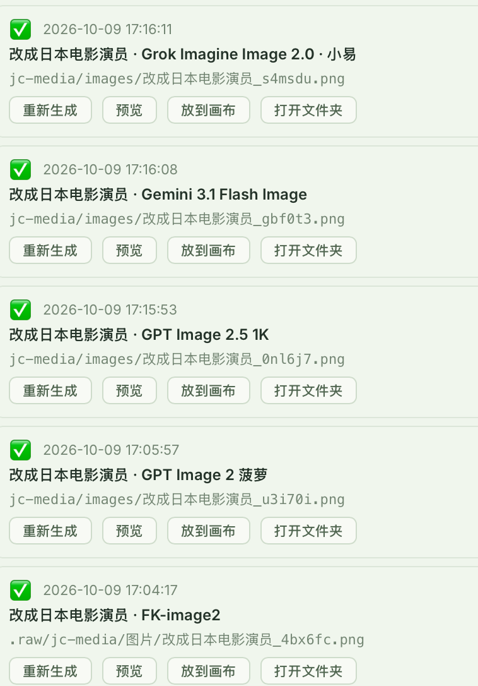

# 图生图 multipart 请求头丢失：根因与修复

> 日期：2026-10-09
> 状态：生产补丁与新 Mac 预览包已部署/构建，用户确认 FK、菠萝、小易等五个截图型号图生图成功并显示本地结果路径；全部型号/视频/平台及账单未逐项验收。

## 根因

OSS 切换脚本从官方 NewAPI rc.40 SHA `0aec08fee811ec6136828fda790551b49e410301` 重建服务端。该版本的 Task Plugin 宿主在 `BuildRequestBody` 重建 multipart 正文后，只把新 boundary 的 `Content-Type` 写进 `c.Request.Header`（客户端入站请求）。`DoTaskApiRequest` 用 `http.NewRequestWithContext` 创建独立的上游请求，`BuildRequestHeader` 只复制插件 descriptor 的 `headers`，不会复制入站请求头。

FK 和小易插件的 multipart descriptor 都交由宿主生成 boundary，没有手写 `Content-Type`。结果：真正发送的 HTTP 请求有表单正文，却没有 `Content-Type: multipart/form-data; boundary=...`，接收端无法读取表单中的 model、prompt 和参考图片。文生图 JSON 分支显式带 `application/json`，所以没有相同缺陷。

链路：App multipart → NewAPI 正确解码 model/图片 → 插件正确生成 parts → **宿主新建上游 HTTP 请求时漏掉表单 Content-Type** → 上游解析不到字段。NewAPI 日志中的非空 `upstream_model_name` 是路由元数据，不能证明上游收到了非空 model 表单字段。

官方源码依据：[rc.40 宿主 adaptor](https://github.com/QuantumNous/new-api/blob/0aec08fee811ec6136828fda790551b49e410301/relay/channel/task/jsplugin/adaptor.go)、[上游请求创建](https://github.com/QuantumNous/new-api/blob/0aec08fee811ec6136828fda790551b49e410301/relay/channel/api_request.go)。本机复现的两文件修复前已与该 SHA 的 raw 文件逐字节比对一致。

## OSS 与实际 App 版本

- `/api/creations/upload-url`、OSS 上传和签名读取是独立路由；H3 三秒图生视频成功不能代替 multipart 图片编辑路由验收。
- 用户 15:20 的 FK HTTP 403 和小易 HTTP 400 不能单凭报错字符串判定账号权限或供应商内部故障；共同 multipart 传输缺陷必须先修复。
- 本机当前运行的桌面进程是 `src-tauri/target/release/bundle/macos/韭菜盒子.app/Contents/MacOS/jiucaihezi-app`，可执行文件修改时间为 **2026-10-09 12:47:24**；FK 图片改走 OSS＋JSON 的源码修改时间为 **15:10:55**。12:41 的 dist 中也没有新增的“提交图生图任务”分支。该运行包没有包含下午的 FK URL 修复，不能把源码改动记为客户端已生效。
- FK 的 OSS＋JSON URL 方案保留；它绕过 multipart，但不能恢复小易和其它现有 multipart 用户。宿主修复是恢复公共协议的必要措施。

## 复现与修复

测试源码：`scripts/newapi-media/regression/task_multipart_header_test.go`，复制实际 `fk.plugin.js` 和 `xiaoyi-image.plugin.js` 到固定 NewAPI 的 jsplugin 测试目录。使用真实插件解码、真实 `BuildRequestBody` / `DoRequest`，接收端是本地 `httptest`，不调用供应商或生成计费。

- 修复前：两条 JSON 文生图正常；FK 与小易各自单图、多图编辑共四例均得到 `outbound Content-Type="" parsed_model=""`，接收端报 `request Content-Type isn't multipart/form-data`。
- 补丁：在 multipart 正文构建完成后，将该 writer 的 `FormDataContentType()` 保存到 **上游 descriptor.Headers**；清理大小写不同的旧 Content-Type，确保表头 boundary 与发送正文一致。
- 修复后：七例全部通过，接收端能解析正确模型、prompt 和原始 PNG 字节；FK 签名 URL JSON 的完整地址与 query 保留用例也通过。jsplugin、jcmedia、ossdirect 三个完整 Go 包测试通过，router 编译检查通过。生产出图仍需部署后验收。

补丁重放入口：`scripts/newapi-media/patch_task_multipart.py`；已有 OSS 服务修复入口：`scripts/newapi-media/repair-multipart.sh`。未来初次准备镜像的 `prepare.sh` 也包含该宿主修复。

## 服务器执行与回滚

将修复包上传 `/root`，解压后执行 `scripts/newapi-media/repair-multipart.sh`。脚本核对当前 OSS 镜像标签、Compose 三文件、固定上游 SHA 和已有扩展；先重建 Linux builder 并运行真实宿主/素材/OSS 测试，再构建生产镜像；数据库备份验证完成后只替换 OSS override 中的镜像行。

新镜像为 `jiucaihezi/new-api:rc40-local-media-ossdirect-multipart-20261009`。健康或镜像检查失败自动恢复旧 Compose；手动回滚脚本位于 `/root/jc-multipart-switch-<UTC>/rollback.sh`。成功输出 `MULTIPART HOST FIX ACTIVE` 仅确认补丁部署与健康，不能记为真实图生图已成功。

部署后分别验收 FK 和小易单张参考图：成功图片、下载落盘、按次计费与失败退款。此前小易任务 `$0.08` 按次计费且日志没有退款记录仍需核账，不因定位到传输缺陷而消失。

## 对此前结论的纠正

此前将 FK 的 403 直接归因于账号模型权限、将小易任务号和非空映射视为供应商内部故障证据，均过早。真实上游表单请求缺头的复现证据优先；历史报错、扣费和退款日志保留，但权限与生产恢复必须重新验收。

## 16:25 生产切换及 16:26 后续失败

用户回执确认新镜像 `rc40-local-media-ossdirect-multipart-20261009` 已启动，数据库归档验证 414200674 字节，备份目录 `/root/jc-multipart-switch-20261009T082505Z`。随后 inspect 确认该镜像 running。

16:26:18 的 FK-image2 edits 请求 `202610090826181584946228268d9d6j7XxNH3L` 在渠道 #150 得到空响应体 HTTP 500，耗时 8.688 秒；预扣 `$0.08` 已退回。固定源码 `relay/relay_task.go` 的 `fail_to_fetch_task` 分支表明此次失败发生于上游提交返回非 2xx 时，尚未进入成功提交后的任务解析与轮询。这不能证明 multipart 修复后整条生产链路已恢复，也不能据空 500 判定 FK 内部故障；下一步需要提交阶段的完整窗口日志及实际传输证据。

用户随后提供完整 16:26:10–16:26:35 窗口日志，仍只有空正文 500，没有供应商详细响应。下一步用 `scripts/newapi-media/check-fk-oss-json.py` 做一次 OSS＋JSON 对照：生成 512×512 合成图，OSS 直传与字节读回后，仅提交一次相同 FK-image2 模型的 JSON imageUrls。Key 隐藏输入，签名链接不输出，不改服务配置；可能产生一次按渠道价格的生成费，不自动重试。脚本本地自检通过，生产对照尚未执行。

## 16:46 OSS＋JSON 生产对照成功

用户执行 `jc-fk-json-check.py`：512×512 合成 PNG 直传 OSS 并完整字节读回通过；相同渠道模型 FK-image2 `ft-image-v1-211f28f47b0355abb1798f72eb65f22d` 以 JSON imageUrls 请求本机 NewAPI，HTTP 200，返回一张图片。请求 ID `202610090846053942508448268d9d6DWjLrxp6`。脚本未下载成品，也未核对该次生成账单。

该反证确认相同账号/模型能执行图生图，OSS 签名地址也能被 FK 使用；之前将 403 归因账号无权限的结论不成立。当前生产可用路径为 OSS＋JSON。multipart 修复后仍空正文 500 的具体原因尚未确认，不能将本地接收端回归记为 FK multipart 生产通过；其它上游图片编辑也未在本次验收。App 源码已有 FK URL 路径，接下来构建并验证实际运行包；端到端 App 点击生成、成品下载落盘仍待验收。

本机 `pnpm exec tauri build --bundles app` 构建成功（v2.2.25，Apple Silicon Mac 预览包）。构建前执行的 TypeScript 检查、Desktop quick build 和产物审计通过；新 dist 已包含 FK OSS＋JSON 提交分支。正式公证/分发、Intel Mac、Windows 与实际 App 图生图点击和下载未验收。旧运行进程未主动关闭，用户需完全退出后打开新构建包。

## 用户确认 App 成功与适用范围

新 Mac 预览包交付后，用户明确回复“成功了”，确认此次 FK-image2 App 图生图重试成功。用户回执未单独说明下载落盘或账单，不扩大为所有型号、全部插件或全平台通过。

源码范围：FK `newapi/fk/ft-image-v1-*` 共用 URL 素材与 JSON 提交；FK H3 图生视频此前三秒生产实测通过。其它 `openai-image-edits` / `newapi-image-task` 仍使用 multipart，小易图片插件仍需要 fileRef 并向上游提交 multipart；Veo-3.1 的 openai-videos 也保留 multipart；本地 Comfy 采用 base64。其余远程视频按各自合同使用 URL 或专有上传，不等于已逐型号验收。OSS 直传用于参考素材，生成成品仍按上游结果地址下载，未改为全部成品存 OSS。

## 17:16 多模型 App 图生图验收

用户明确确认菠萝、小易测试均成功，并提供 App 任务历史截图。截图中以下图生图均为绿色成功状态，并显示本地 PNG 路径：

| 截图时间 | 模型显示名 | 结果 |
| --- | --- | --- |
| 17:04:17 | FK-image2 | 成功，显示本地 PNG 路径 |
| 17:05:57 | GPT Image 2 菠萝 | 成功，显示本地 PNG 路径 |
| 17:15:53 | GPT Image 2.5 1K | 成功，显示本地 PNG 路径 |
| 17:16:08 | Gemini 3.1 Flash Image | 成功，显示本地 PNG 路径 |
| 17:16:11 | Grok Imagine Image 2.0 小易 | 成功，显示本地 PNG 路径 |

证据范围：用户实测回执和任务历史截图确认上述型号生成成功及 App 显示结果落盘路径；未逐一打开文件核对字节，也未核实每次账单或旧失败任务退款。没有逐个验收模型目录中的所有型号、所有视频、所有平台。小易仍走文件 multipart，FK 本地素材走 OSS＋JSON，菠萝/Gemini 成功也不代表它们都改成 OSS URL。
