# 新手教程

## 韭菜盒子 Web 端生图生视频步骤

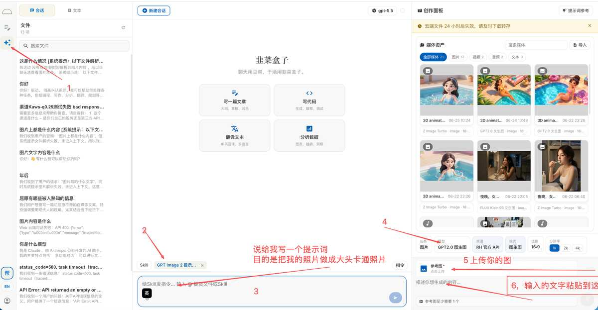

点击右上角的提示词参考进入搭子提示词库，直接照抄提示词。

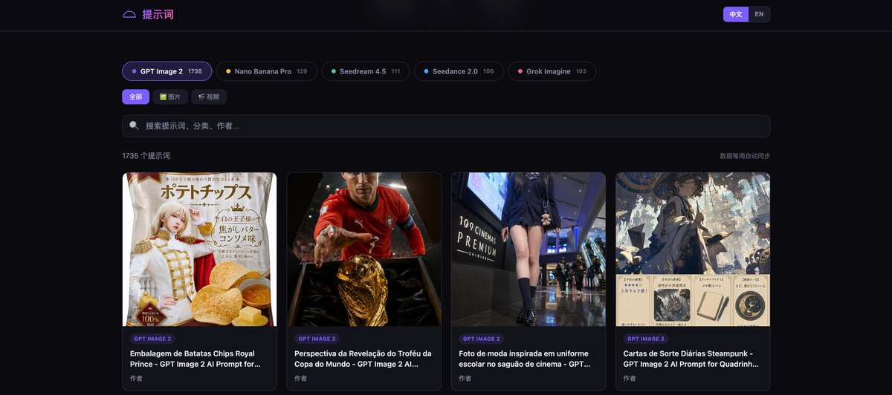

---

## 配置 CC Switch 使用 Claude Code 和 Codex

先打开官网：

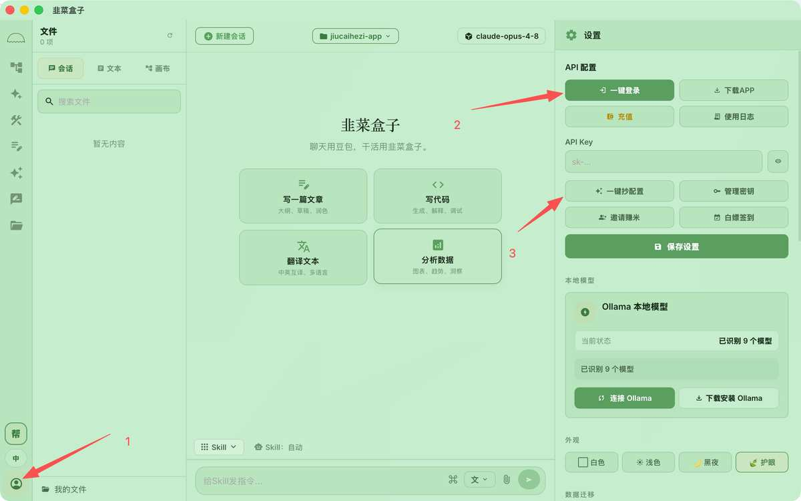

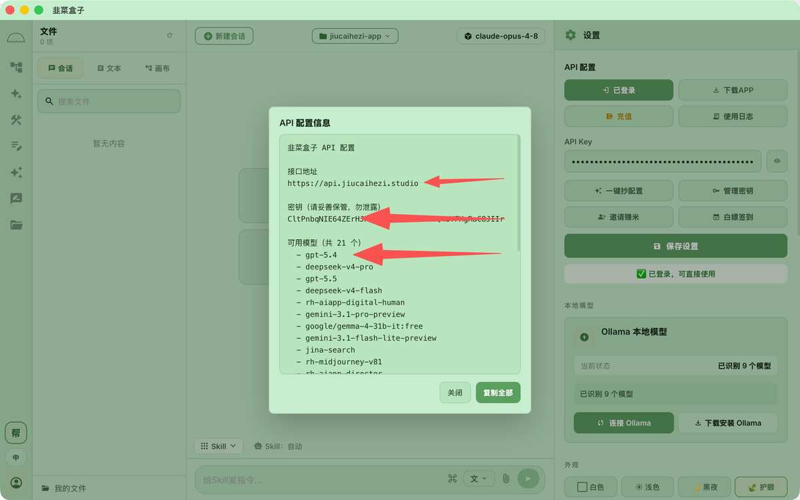

如果想自己选分组，看创建秘钥步骤，点击管理秘钥：

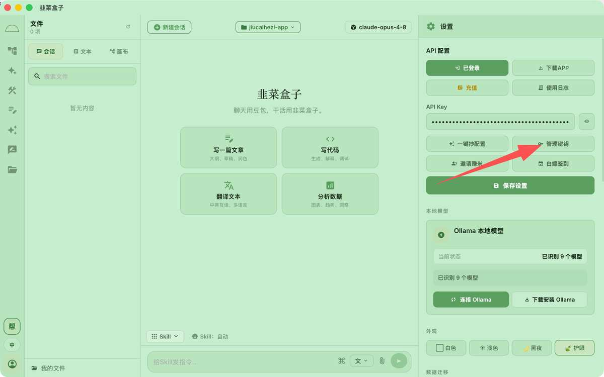

或者进入网站后台：

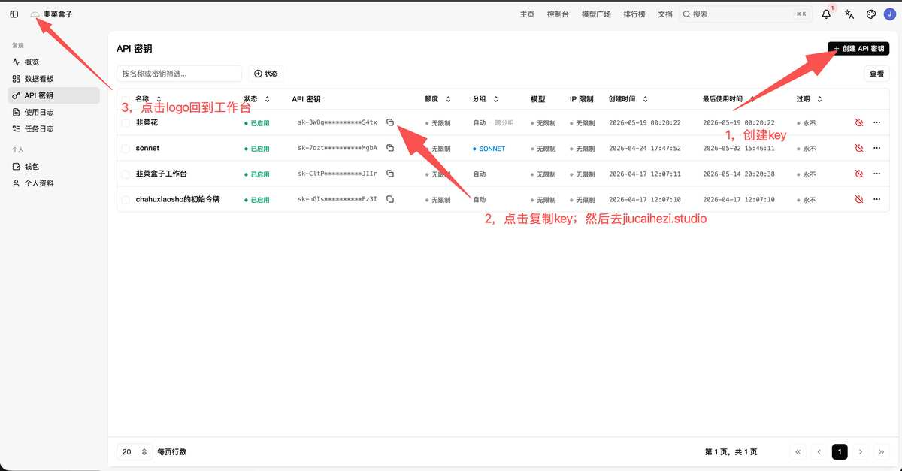

### 如何选分组

- **用 Codex**：选 `0.5`、`1`、`川普特供`
  - `0.5` = GPT Plus 会员，约 0.5 元人民币 = 1 美金，官方折扣约 1/14
  - `1` = GPT PRO 会员，约 1 元人民币 = 1 美金，官方折扣约 1/7
  - `川普特供` = 官方原价，7 元人民币 = 1 美金

- **用 Claude Code**：选 `0.5`、`1.5`、`2`、`3.2`、`川普特供`
  - `0.5` 只能用 Haiku 和 Sonnet 模型，且不稳定，经常被封杀

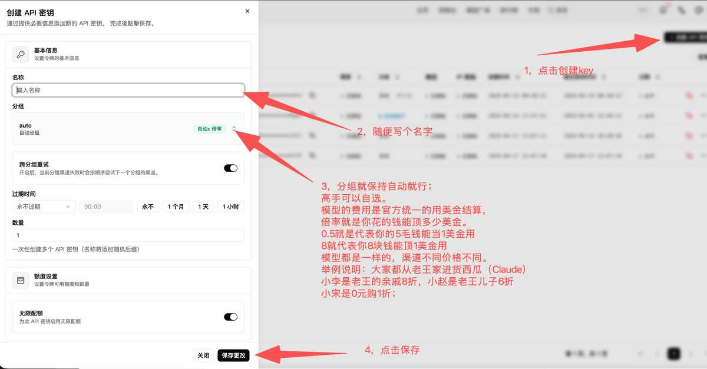

---

## Claude Code 和 Codex 配置教程

我们使用 **CC Switch**（无需在终端复杂设置即可使用 Claude Code 和 Codex）。

### 第一步：下载 CC Switch

[CC Switch 官方网站 - AI 编程 CLI 统一管理工具](https://ccswitch.app)

### 第二步：添加供应商 API

1. 打开 CC Switch
2. 点击右上角的红色「➕」按钮，选择「统一供应商」

   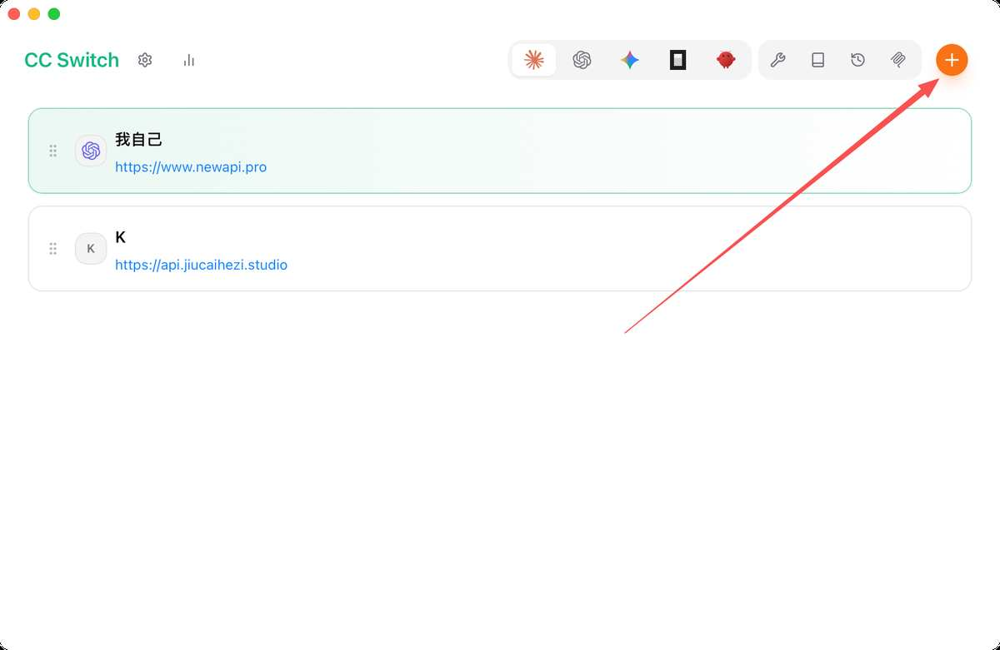

3. 点击右下角的「添加统一供应商」

   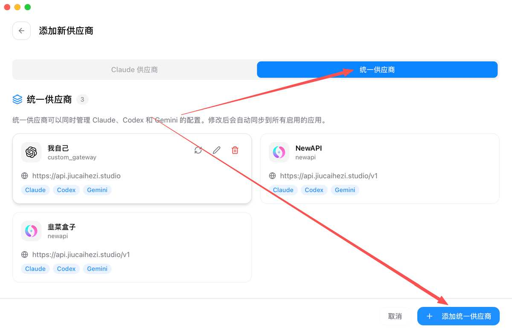

4. 进入界面后，填入你的 **API 地址** 和 **API Key**

   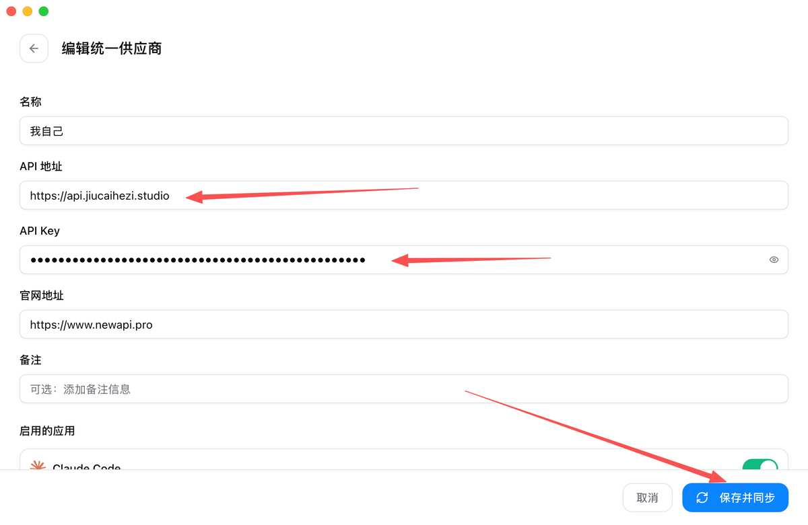

5. 填写无误后，点击「保存并同步」

### 第三步：配置本地代理

1. 点击界面上的「小齿轮」图标

   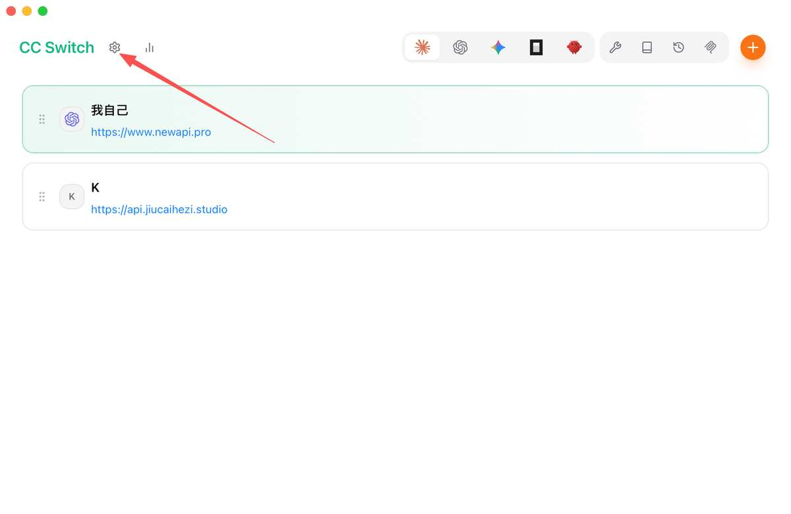

2. 依次进入「设置」→「代理」→「本地代理」
3. 将「代理总开关」打开
4. 将 **Claude** 和 **Codex** 的代理开关也一并打开

   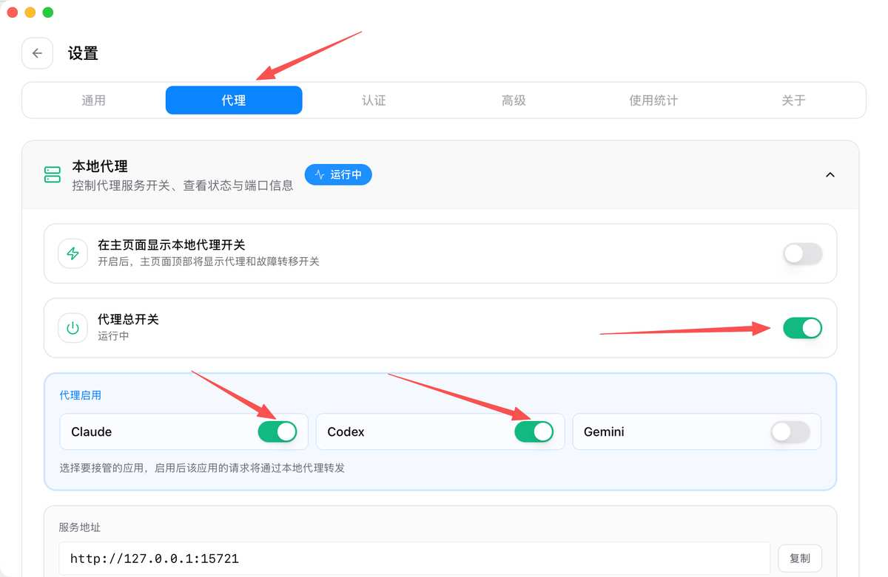

### 第四步：启用目标环境

1. 在界面上方，选择你要使用的环境是 **Claude** 还是 **Codex**
2. 点击「启用」，即可开始使用！

   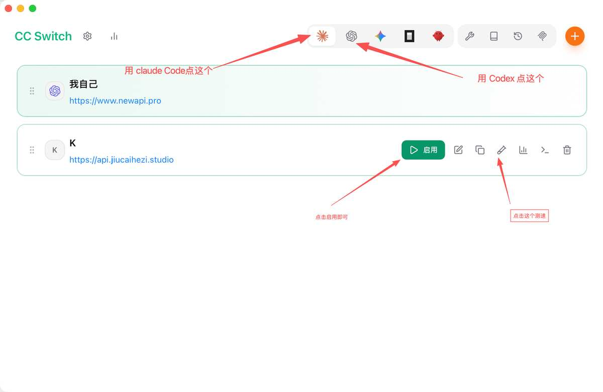

---

## 报错问题

1. 把报错截图发给韭菜盒子 Studio，大部分问题能解决

   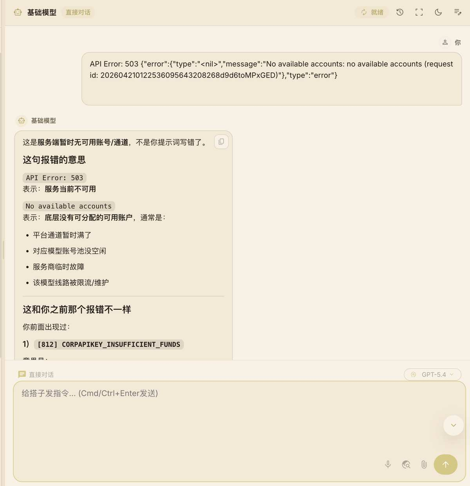

   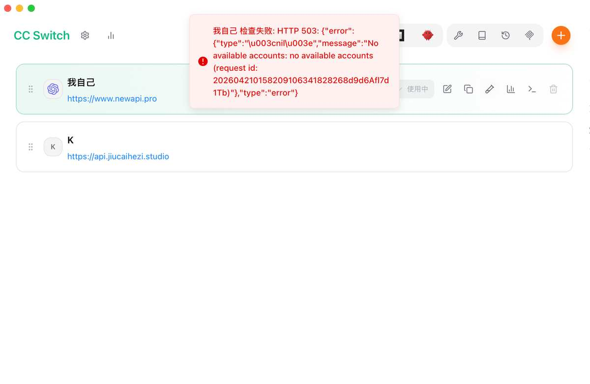

2. 如显示下面内容，说明 Claude 上游不让用了（现在 Claude 官方很严）

3. 正常使用如图：

   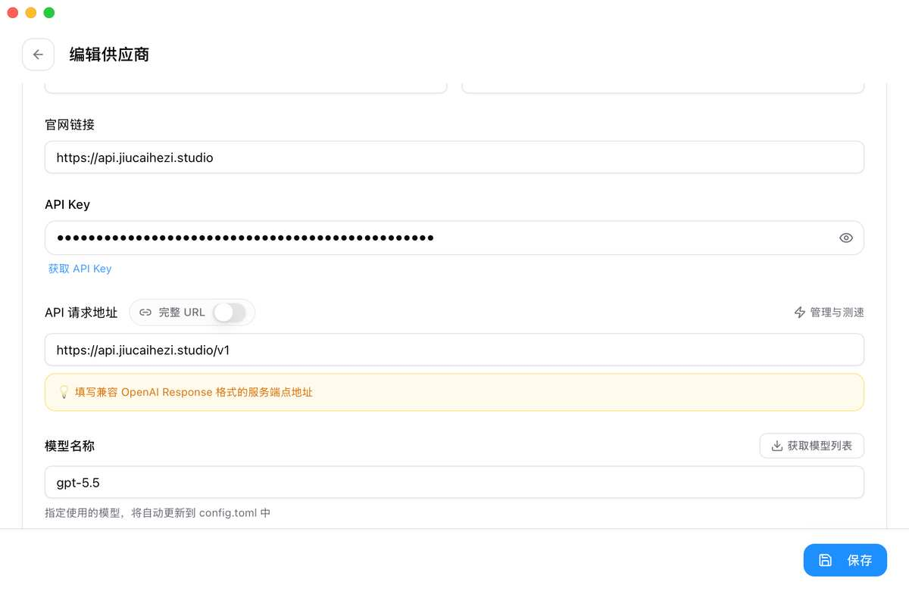

出现报错，大概率是 API 请求地址的问题。尝试加上 `/v1`，不行就去掉 `/v1`，大概率就能用了。

### 视频教程

<https://v.douyin.com/yMm7CZJTGaM/>

---

## 直接用终端的方法

> 下面这份可以直接发给用户。

### 韭菜盒子 API Key 使用攻略

适用于：Claude Code / Codex

### 一、你需要准备什么

你需要先注册/登录韭菜盒子账号，并获得一个专属 API Key。这个 Key 用于统一计费，请不要发给别人。

### 二、配置 Claude Code

**1. 安装 Claude Code**

如果你还没安装 Claude Code，先去官方安装。安装完成后，打开 Mac 终端。

**2. 创建 Claude Code 配置文件**

在 Mac 终端复制执行：

```bash
mkdir -p ~/.claude
cat > ~/.claude/settings.json <<'EOF'
{
  "env": {
    "ANTHROPIC_AUTH_TOKEN": "把这里换成你的韭菜盒子APIKey",
    "ANTHROPIC_BASE_URL": "https://api.jiucaihezi.studio",
    "ANTHROPIC_MODEL": "claude-sonnet-4-6",
    "ANTHROPIC_DEFAULT_SONNET_MODEL": "claude-sonnet-4-6",
    "ANTHROPIC_DEFAULT_OPUS_MODEL": "claude-sonnet-4-6",
    "DISABLE_AUTOUPDATER": "1"
  },
  "skipDangerousModePermissionPrompt": true
}
EOF
```

把 `"把这里换成你的韭菜盒子APIKey"` 替换成你自己的 Key。

**3. 启动 Claude Code**

```bash
claude
```

进入后测试：输入 `你好，回复123`，如果返回 `123` 说明配置成功。

### 三、配置 Codex

**1. 创建 Codex 配置文件**

在 Mac 终端复制执行：

```bash
mkdir -p ~/.codex
cat > ~/.codex/config.toml <<'EOF'
model = "gpt-5.5"
model_provider = "jiucaihezi"
model_reasoning_effort = "high"

[model_providers.jiucaihezi]
name = "jiucaihezi gateway"
base_url = "https://api.jiucaihezi.studio/v1"
env_key = "OPENAI_API_KEY"
wire_api = "responses"
supports_websockets = false
EOF
```

**2. 写入你的 API Key**

```bash
echo 'export OPENAI_API_KEY="把这里换成你的韭菜盒子APIKey"' >> ~/.zshrc
source ~/.zshrc
```

把 `把这里换成你的韭菜盒子APIKey` 替换成你自己的 Key。

**3. 打开 Codex App**

完全退出 Codex App，然后重新打开。如果你用的是终端版 Codex：

```bash
codex
```

进入后测试：回复 `123`，如果能正常回复，说明 Codex 配置成功。

### 四、关键区别

| | Claude Code | Codex |
|---|---|---|
| 环境变量 | `ANTHROPIC_AUTH_TOKEN` | `OPENAI_API_KEY` |
| API 地址 | `https://api.jiucaihezi.studio` | `https://api.jiucaihezi.studio/v1` |

**注意**：Claude Code 的地址不要带 `/v1`；Codex 的地址必须带 `/v1`。

### 五、常见问题

**1. Claude Code 提示模型不可用**

检查 `~/.claude/settings.json` 里的模型名是否是 `"claude-sonnet-4-6"`

**2. Codex 没有走韭菜盒子 API**

检查 `~/.codex/config.toml`：
- `base_url = "https://api.jiucaihezi.studio/v1"`
- `model_provider = "jiucaihezi"`
- `wire_api = "responses"`

**3. Key 配错了怎么办**

重新执行对应配置命令，把 Key 换成新的即可。

**4. API Key 能不能给别人用**

不要。API Key 绑定你的账户余额和使用记录，泄露后别人可能消耗你的额度。

---

## 魔法上网

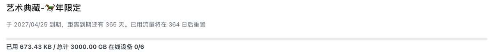

订阅：<https://xn--oqqy6qcpoh09a.com/#/register?code=d2dO7zyA>

使用软件：[Clash Verge Rev](https://github.com/clash-verge-rev/clash-verge-rev/releases)
