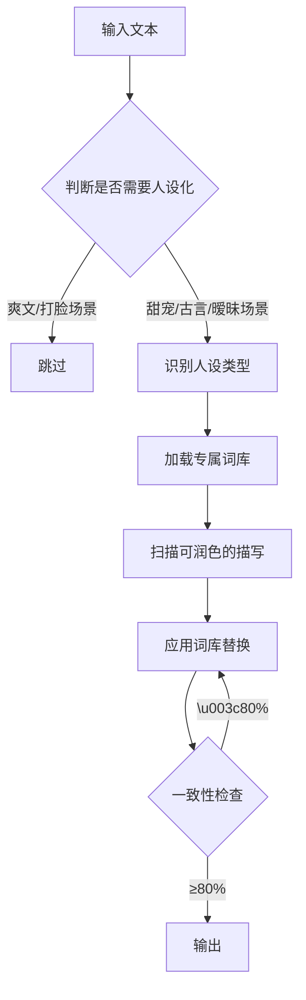

# SKILL-05: 人设化润色器

## 核心职责

**唯一目标**：根据角色人设，应用专属润色词库，避免所有人设都是"冷冷地"、"淡淡地"

---

## 输入/输出Schema

### 输入

```json
{
  "text": "已完成微观修辞升级的段落",
  "character_type": "高冷/软萌/霸道/腹黑/...",
  "scene_type": "日常/暧昧/打脸/..."
}
```

### 输出

```json
{
  "personalized_text": "人设化后的文本",
  "vocabulary_used": ["袖口", "领口", "喉结"],
  "character_consistency": "95%",
  "self_check_passed": true
}
```

---

## 核心人设词库

### 人设1：清冷/高冷人设

**常见问题**：

```
❌ 只会：
   他冷冷地笑
   他冷冷地说
   他冷漠地看着她
   
太单调！
```

**润色方案**：

#### 方案1：聚焦局部特写

```
不写全身，写局部细节：
- 袖口
- 领口
- 脊背
- 手指
- 喉结

示例：
❌ 他站在那里，很冷漠
✅ 他修长的手指轻轻敲击桌面，
   细白的指节泛着冷色调的光
```

#### 方案2：环境借代

```
用环境形容人：
- 雪
- 月
- 寒风
- 冰
- 霜

示例：
❌ 他的声音很冷
✅ 声音像初雪浸过，冷而轻

❌ 他眼神很淡
✅ 眼神像被月光洗过的湖面
```

#### 方案3：行为反差

```
虽然高冷，但在受/女主出现时：
- 抬手松了松领带
- 手指顿了顿
- 眼神停留了片刻
- 喉结微微滚动

示例：
他向来冷淡，
但在看到她的瞬间，
抬手松了松领带，
喉结微微滚动。
```

**高冷人设专属词库**：

| 类别 | 词汇 |
|------|------|
| 动作 | 顿了顿/停留/敲击/拂过/挑眉 |
| 局部 | 袖口/领口/喉结/手指/脊背 |
| 环境 | 雪/月/寒风/冰/霜/清冷 |
| 声音 | 淡/轻/冷/低沉/磁性 |

---

### 人设2：软萌人设

**专属词库**：

```
动作：
- 小小声
- 嗫嚅
- 眨巴眼睛
- 鼓起脸颊
- 扁嘴

神态：
- 眼睛弯成月牙
- 脸颊粉粉的
- 撒娇地看着

声音：
- 糯糯的
- 软软的
- 奶声奶气
```

**示例**：

```
❌ 她小声说：好的
✅ 她小小声地嗫嚅：好、好的...
   眼睛弯成月牙
```

---

### 人设3：霸道人设

**专属词库**：

```
动作：
- 强势地
- 手指抬起她的下巴
- 困住
- 按/压/圈

语气：
- 笃定
- 不容拒绝
- 低沉带着警告

神态：
- 眉峰一挑
- 眼神带着侵略性
```

**示例**：

```
❌ 他说：听我的
✅ 他手指抬起她的下巴，
   声音低沉带着不容拒绝：
   "听我的"
```

---

### 人设4：腹黑人设

**专属词库**：

```
表情：
- 似笑非笑
- 勾唇
- 眼底闪过暗光
- 意味深长地看着

动作：
- 轻轻拍手
- 饶有兴致地
- 若有所思地

语气：
- 意味深长
- 带着笑意
- 漫不经心
```

**示例**：

```
❌ 他笑着说：有意思
✅ 他似笑非笑，
   眼底闪过暗光：
   "有意思"
```

---

## 人设一致性检查

### 检查标准

```
一致性 = （人设匹配词汇数 / 总词汇数）× 100%

目标：≥80%
```

### 检测算法

```python
def check_consistency(text, character_type):
    # Step 1: 提取文本中的动作/神态/语气词
    extracted_words = extract_descriptive_words(text)
    
    # Step 2: 查询人设专属词库
    persona_vocab = load_persona_vocabulary(character_type)
    
    # Step 3: 计算匹配度
    matched = 0
    for word in extracted_words:
        if word in pars_vocab:
            matched += 1
    
    consistency = (matched / len(extracted_words)) * 100
    
    return consistency
```

---

## 应用场景判断

### 何时使用人设化润色

| 文本类型 | 使用强度 | 原因 |
|---------|---------|------|
| 爽文/现言 | 低（20%） | 保持简洁，人设化仅用于关键场景 |
| 甜宠 | 中（50%） | 暧昧/互动场景必须人设化 |
| 古言 | 高（80%） | 氛围营造需要大量人设化 |

### 何时跳过

- 打脸场景（动作优先，不需要过多修饰）
- 过渡场景（快速跳过）
- 配角视角（不是重点）

---

## 综合工作流程



---

## 自检清单

- [ ] 人设类型识别正确？
- [ ] 应用的词库与人设匹配？
- [ ] 一致性≥80%？
- [ ] 是否过度修饰（爽文应保持简洁）？
- [ ] 同一词汇是否重复超过3次？

---

## 边界情况处理

### 情况1：多重人设角色

```
问题：角色既高冷又腹黑

方案：
- 主人设：高冷（80%）
- 辅助人设：腹黑（20%）
- 日常用高冷词库
- 算计时用腹黑词库
```

### 情况2：人设转变

```
问题：高冷人设在恋爱后变温柔

方案：
- 前期：100%高冷词库
- 恋爱后：70%高冷 + 30%温柔词库
- 渐进式转变
```

### 情况3：找不到合适词汇

```
问题：词库中没有合适的词汇

方案：
- 使用通用词汇
- 标记为待扩展
- 优先保证文本流畅性
```

---

## 扩展资源

详细资料见`SKILL-05_references/`目录（按需加载）：

- `persona-vocabulary-full.md`：20种人设的完整词库（5000+词汇）
- `persona-combination-rules.md`：多重人设组合规则
- `persona-transition-guide.md`：人设转变润色指南
- `custom-persona-builder.md`：自定义人设词库构建器

---

**创建日期**：2026-01-23  
**版本**：1.0  
**Token估算**：L2主文档约900 tokens
