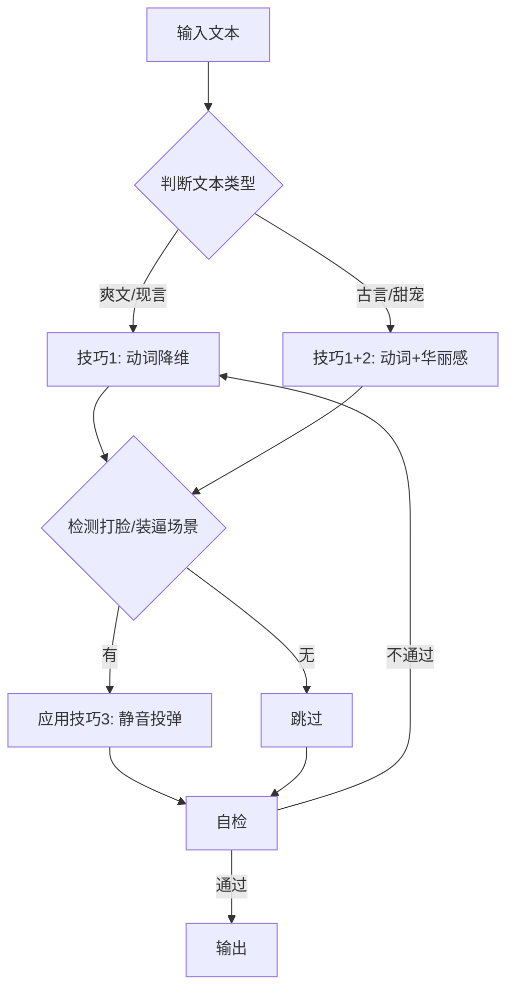

# SKILL-01: 微观修辞升级器

## 核心职责

**唯一目标**：从"准确"提升到"高级"，从"说清楚"提升到"有质感"

包含3大技巧：

1. 动词降维/名词升维
2. 华丽感四维公式
3. 静音投弹法则

---

## 输入/输出Schema

### 输入

```json
{
  "text": "已完成视角修正和心理侧面化的段落",
  "text_type": "爽文/古言/甜宠/现言",
  "upgrade_level": "basic/full"
}
```

### 输出

```json
{
  "upgraded_text": "升级后的文本",
  "applied_techniques": ["动词降维", "华丽感", "静音投弹"],
  "changes_count": 12,
  "self_check_passed": true
}
```

---

## 技巧1：动词降维与名词升维

### 核心原则

```
拒绝：宽泛动词 + 形容词
改用：具体动词/名词
```

### 常见动词替换表

| 普通动词 | 具体动词（降维后） |
|---------|-------------------|
| 看 | 盯/瞥/瞄/凝视/打量/扫视/睨/窥 |
| 说 | 低语/咆哮/嘟囔/吼/嘀咕/道/问/答 |
| 走 | 踱步/冲/窜/溜/飘/踏/奔/晃 |
| 拿 | 抓/握/攥/捏/夺/执/撰/搂 |
| 笑 | 轻笑/冷笑/嗤笑/狞笑/浅笑/嬉笑 |
| 哭 | 啜泣/抽泣/号啕/呜咽/落泪 |
| 坐 | 瘫/跪/蹲/倚/靠/斜倚 |
| 关门 | 推门/踹门/甩门/掩门/带上门 |

### 名词升维

**错误示例**：

```
❌ 他不可置信地看着他
   → 形容词+宽泛动词
```

**正确示例**：

```
✅ 他两眼瞪得溜圆，
   惊讶得嘴巴几乎能塞下一个鸡蛋
   → 具体名词+夸张动词
```

### 自检清单

- [ ] 检查是否有大量"xx地+动词"结构
- [ ] 尝试删除"地"字，看能否用更具体的动词
- [ ] "看/说/走"是否都被替换

---

## 技巧2：华丽感四维公式

### 核心公式

```
颜色 + 气味 + 味觉 + 实物比喻 = 华丽感
```

### 应用示例

**维度1：颜色升维**

```
普通颜色词                  高级颜色词
─────────────────────────────────────
深蓝                       黛蓝、石青、靛青
白色                       茶白、月白、雪白
红色                       绯红、朱红、猩红、胭脂
黑色                       墨色、漆黑、乌黑
金色                       琉璃金、赤金、流金
绿色                       翠绿、碧绿、墨绿、松石绿
```

**维度2：气味/味觉**

```
❌ 他靠近了她
✅ 他靠近，鼻尖飘来好闻的气息

❌ 她很开心
✅ 她心里像吃了蜜糖一样甜
```

**维度3：实物比喻**

```
❌ 她头发很柔软
✅ 她头发像海藻一样蓬松柔软

❌ 他眼睛很漂亮
✅ 他眼睛像月光洗过的湖面
```

### 使用时机

| 文本类型 | 华丽感强度 | 使用场景 |
|---------|-----------|---------|
| 爽文/现言 | 低（10%） | 仅人物首次出场 |
| 甜宠 | 中（30%） | 暧昧/亲密场景 |
| 古言 | 高（60%） | 环境描写、重要场景 |

**警告**: 不要过度使用，爽文保持简洁！

---

## 技巧3：静音投弹法则

### 核心原则

```
越惊世骇俗的台词/动作，越要轻描淡写
```

### 心理基础

就像电影里爆炸前的静音。大佬做狠事，不需要大喊大叫。

### 对比示例

**错误（无能狂怒）**：

```
❌ 男主愤怒地大吼：
   "我要杀了你全家！"
```

**正确（大佬气场）**：

```
✅ 男主轻描淡写地说：
   "师父，是你教我的，做人要狠。"
   （同时捅了师父一刀）
```

### 实施公式

```
越狠的事 → 越轻的语气
越强的招 → 越淡的描述
```

**模板库**：

| 场景 | 传统写法 | 静音投弹写法 |
|------|---------|-------------|
| 放大招 | "去死吧！"（大吼） | "麻烦让一让"（平静） |
| 终极打脸 | "看清楚了吗！" | "哦，忘了告诉你..." |
| 霸气宣言 | "我会让你后悔！" | "你会后悔的"（微笑） |

### 应用场景

- 主角放大招时
- 终极打脸时
- 霸气宣言时
- 反派被碾压时

---

## 综合工作流程



---

## 自检清单

- [ ] 动词降维：是否还有"看/说/走"等宽泛动词？
- [ ] 名词升维：是否还有"很+形容词"结构？
- [ ] 华丽感：古言/甜宠场景是否应用了颜色/气味/比喻？
- [ ] 静音投弹：打脸/装逼场景是否用了平静语气？
- [ ] 过度检查：爽文是否过于华丽？（应保持简洁）

---

## 边界情况处理

### 情况1：爽文过度华丽

```
问题：用户要求保持简洁，但错误应用了华丽感

方案：
- 检测文本类型
- 如果是爽文/现言，华丽感仅用于首次出场描写
- 其他场景保持concrete简洁
```

### 情况2：古言不够华丽

```
问题：古言场景但华丽感不足

方案：
- 强制应用颜色升维
- 环境描写必须有实物比喻
- 重要场景加气味/味觉
```

### 情况3：静音投弹过度

```
问题：所有场景都用平静语气，失去变化

方案：
- 静音投弹仅用于"高光时刻"
- 日常对话保持正常语气
- 一章最多1-2次
```

---

## 扩展资源

详细资料见`SKILL-01_references/`目录（按需加载）：

- `verb-noun-full-table.md`：完整的动词/名词替换表（500+词汇）
- `color-vocabulary.md`：100种高级颜色词库
- `metaphor-library.md`：1000+实物比喻库
- `silent-explosion-templates.md`：30种静音投弹模板

---

**创建日期**：2026-01-23  
**版本**：1.0  
**Token估算**：L2主文档约1000 tokens
