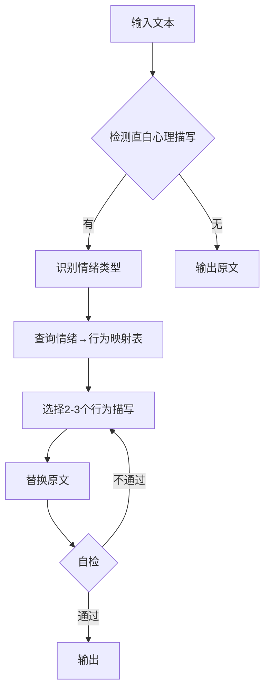

# SKILL-04: 心理描写侧面化器

## 核心职责

**唯一目标**：去除直白的心理描写（tell），转化为行为展示（show）

```
输入：他很紧张
输出：他下意识地整理了一下衣服，手指不自觉地攥紧了
```

---

## 输入/输出Schema

### 输入

```json
{
  "text": "包含直白心理描写的段落",
  "character_personality": "可选，人设标签（用于匹配更精准的行为）",
  "scene_type": "可选，场景类型（如：对话/打脸/甜宠）"
}
```

### 输出

```json
{
  "polished_text": "侧面化后的文本",
  "changes": [
    {
      "before": "他很紧张",
      "after": "他下意识地整理了一下衣服",
      "emotion": "紧张",
      "behavior_type": "下意识动作"
    }
  ],
  "self_check_passed": true
}
```

---

## 核心算法

### 算法：情绪→行为映射表

**Step 1：识别直白心理描写**

```
关键词检测：
- 很+形容词：很紧张/很羞愧/很愤怒/很害怕
- 感到+情绪：感到不安/感到欣喜
- 觉得+判断：觉得奇怪/觉得好笑
- 情绪名词：紧张感/羞愧感/愤怒
```

**Step 2：查询情绪→行为映射表**

| 情绪 | 行为展示（身体反应） | 行为展示（环境互动） |
|------|---------------------|---------------------|
| 紧张 | 手心出汗/攥紧拳头/整理衣服 | 往后退一步/避开视线 |
| 羞愧 | 低下头/耳根发红/不敢看对方 | 转过身/盯着地面 |
| 愤怒 | 胸口起伏/咬紧牙关/握紧拳头 | 摔东西/猛地起身/甩门 |
| 害怕 | 瞳孔收缩/身体颤抖/呼吸急促 | 往后退/躲到角落/声音发抖 |
| 得意 | 嘴角上扬/眼睛发亮/挺直脊背 | 轻笑一声/翘起二郎腿 |
| 尴尬 | 干咳几声/摸鼻子/挠头 | 转移话题/看向别处 |
| 心动 | 脸颊发烫/心跳加速/手足无措 | 偷偷看对方/不自觉靠近 |

**Step 3：替换文本**

```
替换规则：
- 删除情绪词
- 插入行为描写（2-3个细节）
- 保持自然流畅
```

---

## 进阶技巧：多人对话体

**原则**：如果必须写心理活动，用对话代替独白

**错误示例**：

```
❌ 女主想：他喜欢我吗？
```

**正确示例**：

```
✅ 女主在论坛发帖：
   "男神看我一眼是什么意思？"

   楼下回复：
   "暗恋实锤！"
   "别想太多，可能只是路过"
```

**效果**：更有趣，更有画面感

---

## 自检清单

执行完毕后，必须检查：

- [ ] 是否还有"很+形容词"结构？
- [ ] 是否还有"感到、觉得"等词？
- [ ] 行为描写是否具体（不能是"有点紧张"）？
- [ ] 行为描写是否符合人设（高冷人设不会"嘻嘻笑"）？
- [ ] 是否过度修饰（一个情绪不要超过3个行为）？

---

## 边界情况处理

### 情况1：无法用行为展示的抽象情绪

```
问题：如"他感到困惑"

方案：
- 拆解为具体疑问
- 用反问句展示

示例：
❌ 他感到困惑
✅ 他皱眉：为什么她会这么说？
```

### 情况2：多重情绪叠加

```
问题：如"他既紧张又期待"

方案：
- 分阶段展示
- 先A情绪，后B情绪

示例：
❌ 他既紧张又期待
✅ 他手心出汗（紧张），
   但眼睛却难掩兴奋（期待）
```

### 情况3：人设特殊行为

```
问题：高冷人设不能用普通紧张表现

方案：
- 参考人设化润色器（SKILL-05）
- 用微小细节展示

示例：
普通人紧张：整理衣服
高冷人设紧张：手指微不可察地顿了顿
```

---

## 常见错误与修正

### 错误1：行为太抽象

```
❌ 他有些不安
   → 还是tell，不是show

✅ 他往后退了半步
   → 具体行为
```

### 错误2：行为与情绪不匹配

```
❌ 他害怕时笑了笑
   → 矛盾

✅ 他害怕时，声音都在颤抖
   → 匹配
```

### 错误3：过度堆砌

```
❌ 他紧张得手心出汗、攥紧拳头、整理衣服、
   往后退、避开视线、干咳几声......
   → 太多了！

✅ 他手心出汗，下意识地整理了一下衣服
   → 2-3个即可
```

---

## 工作流程



---

## 扩展资源

详细资料见`SKILL-04_references/`目录（按需加载）：

- `emotion-behavior-full-table.md`：完整的情绪→行为映射表（50+情绪）
- `character-specific-behaviors.md`：不同人设的专属行为库
- `advanced-techniques.md`：多人对话体、意识流等高级技巧

---

**创建日期**：2026-01-23  
**版本**：1.0  
**Token估算**：L2主文档约800 tokens
