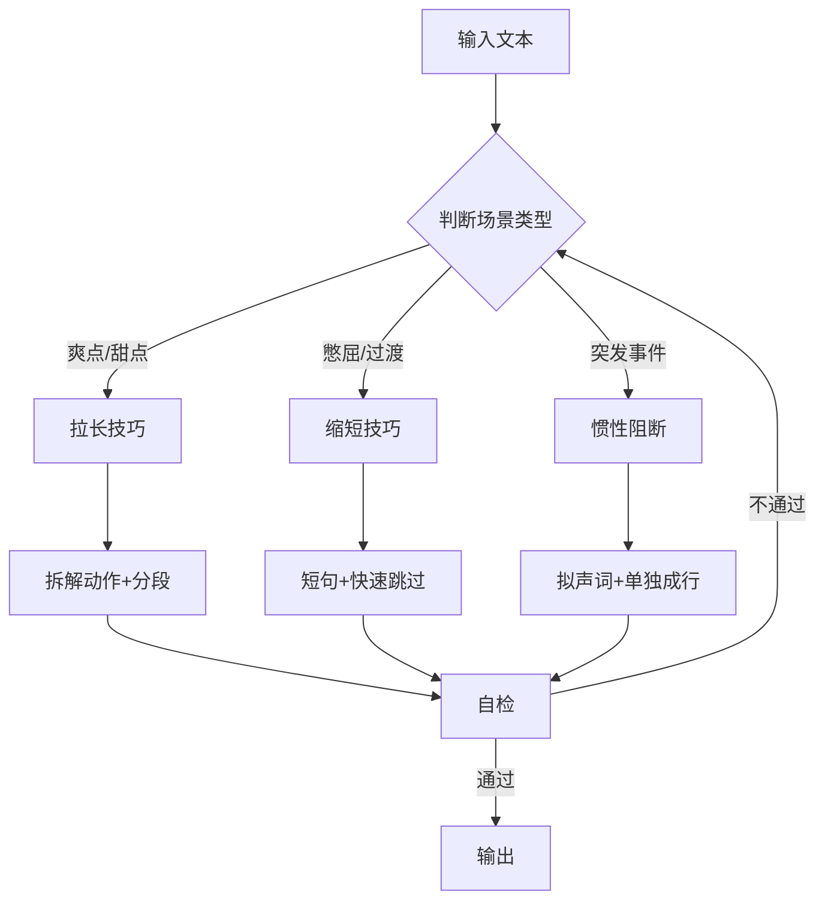

# SKILL-02: 节奏润色器

## 核心职责

**唯一目标**：控制读者的"体感时间"，让爽点更爽，憋屈处快速跳过

包含2大技巧：

1. 惯性阅读阻断
2. 时间魔术（拉长/缩短）

---

## 输入/输出Schema

### 输入

```json
{
  "text": "已完成基础润色的段落",
  "scene_type": "爽点/甜点/憋屈/过渡",
  "desired_pace": "slow/fast/shock"
}
```

### 输出

```json
{
  "paced_text": "调节节奏后的文本",
  "reading_time_change": "+30s / -15s",
  "techniques_applied": ["惯性阻断", "拉长"],
  "self_check_passed": true
}
```

---

## 技巧1：惯性阅读阻断

### 核心目标

制造视觉和心理上的"暂停"，突出重点

### 实施方法

在连续、激烈的描述中，突然插入：

- 极短的动作
- 拟声词
- 单独成行

### 应用示例

**示例1：突发事件**

```
❌ 传统写法：
两人在激烈争吵，你一言我一语，突然她扇了他一耳光。

✅ 惯性阻断：
两人在激烈争吵。
"你凭什么这么说我！"
"我就这么说，怎么了？"

"啪！"

空气中传来一声响亮的耳光。

效果：
- 单独一行的"啪！"
- 强行打断读者阅读惯性
- 制造惊愕感
```

**示例2：关键转折**

```
❌ 传统写法：
她打开门，看到男主站在门口，还淋了雨。

✅ 惯性阻断：
她打开门。

站在门外的，
是淋成落汤鸡的他。

效果：
- 分段
- 制造停顿
- 强化视觉冲击
```

### 应用场景

- 突发事件（耳光、枪声、爆炸）
- 关键转折（身份揭露、误会发现）
- 情绪高潮（表白、决裂）

### 自检清单

- [ ] 是否在关键情节处使用了分段？
- [ ] 拟声词是否单独成行？
- [ ] 是否过度使用（一章不超过3次）？

---

## 技巧2：时间魔术（拉长/缩短）

### 核心原理

```
爽点/甜点 → 拉长阅读时间 → 爽感延长
憋屈/过渡 → 缩短阅读时间 → 快速跳过
```

### 缩短（略写）

**用于**: 读者不爱看的内容

- 压抑的情节
- 无聊的过渡
- 日常流水账

**方法**:

- 强制使用短句
- 不加修饰
- 快速带过

**示例**:

```
❌ 错误（太详细）：
第二天，太阳从东方升起，
她起床，刷牙，洗脸，
换了一身衣服，吃了早餐，
然后出门......（500字）

✅ 正确（极简）：
第二天。
（3个字，直接跳过）
```

### 拉长（详写）

**用于**: 读者爱看的内容

- 苏爽甜的高潮
- 打脸时刻
- 暧昧互动

**方法**:

- 分段
- 插入非连贯动作
- 强行拉长阅读时间

**示例**:

```
快速版（5秒）：
"他笑着说不对。"

慢放版（30秒）：
"他笑了笑。
目光看向远处的荷花，
停留了片刻。
收回视线，
落在她脸上，
声音很淡：'不对。'"

效果：
同一个动作，阅读时间×6
高潮被拉长，爽感更强
```

### 拉长技巧分解

| 技巧 | 示例 | 效果 |
|------|------|------|
| 拆解动作 | 他转身 → 他停顿片刻，缓缓转过身 | +5秒 |
| 插入环境 | 他说 → 风吹过，他说 | +3秒 |
| 加入观察 | 她笑 → 她眼睛弯成月牙，浅浅笑了 | +5秒 |
| 分段停顿 | 连续对话 → 每句话单独一段 | +10秒 |

---

## 综合工作流程



---

## 时间魔术对照表

| 场景类型 | 原始阅读时间 | 目标阅读时间 | 方法 |
|---------|-------------|-------------|------|
| 打脸高潮 | 10秒 | 30-60秒 | 拉长×3-6 |
| 甜宠互动 | 15秒 | 30-45秒 | 拉长×2-3 |
| 憋屈场景 | 30秒 | 5-10秒 | 缩短×3-6 |
| 日常过渡 | 20秒 | 3秒 | 缩短×7 |

---

## 自检清单

- [ ] 爽点/甜点场景是否拉长？（应×2-6）
- [ ] 憋屈/过渡场景是否缩短？（应×3-7）
- [ ] 拉长是否过度（单个动作不超过5个分解）？
- [ ] 缩短是否到位（日常过渡应≤10字）？
- [ ] 整体节奏是否平衡（不能全部拉长或缩短）？

---

## 边界情况处理

### 情况1：打脸场景过短

```
问题：用户简写了打脸高潮，只有2句话

方案：
- 应用拉长技巧
- 拆解为：铺垫→动作→反应→余韵
- 目标：至少拉长到原来的3倍
```

### 情况2：憋屈场景过长

```
问题：憋屈场景写了300字，读者难受

方案：
- 强制缩短到50字以内
- 只保留核心冲突
- 删除所有细节描写
```

### 情况3：惯性阻断过度

```
问题：每个转折都用惯性阻断，失去惊喜

方案：
- 一章最多3次
- 仅用于"震撼级"事件
- 普通转折用普通分段
```

---

## 扩展资源

详细资料见`SKILL-02_references/`目录（按需加载）：

- `pacing-formulas.md`：12种节奏控制公式
- `slow-motion-templates.md`：30种慢动作模板
- `fast-forward-rules.md`：快速跳过规则手册
- `shock-techniques.md`：惊愕感制造技巧大全

---

**创建日期**：2026-01-23  
**版本**：1.0  
**Token估算**：L2主文档约900 tokens
